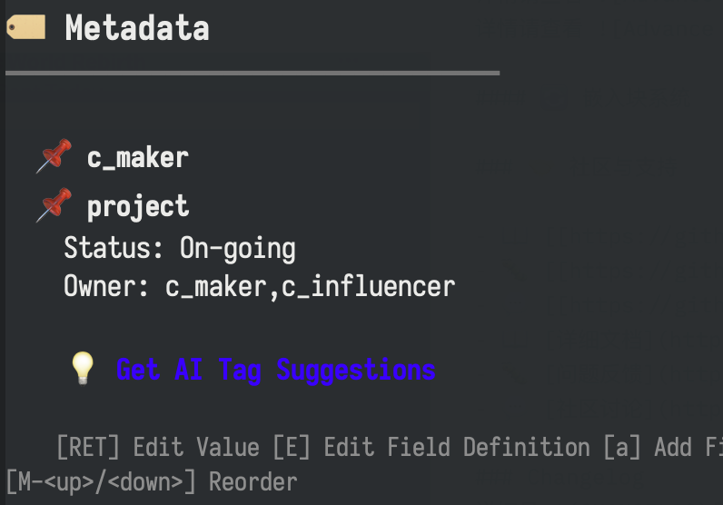
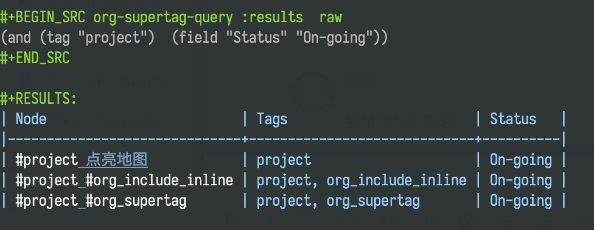
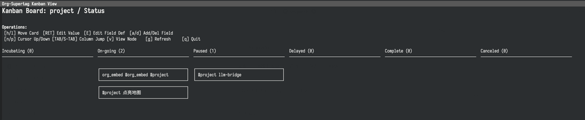

# Org-SuperTag: Supercharge Org-mode with Modern Note-Taking Capabilities

[English](./README.md) | [中文](./README_CN.md)

## ⚠️ Org-SuperTag 5.0 Upgrade Notice

Org-SuperTag 5.0 represents a major architectural overhaul with significant improvements but also breaking changes that require your attention:

### 🏗️ Key Architecture Changes

The new version features a completely redesigned architecture with these major improvements:

- **Pure Emacs Lisp Implementation**: Eliminated all Python dependencies for a lighter, more maintainable codebase (~47% reduction in code size)
- **Data-Centric Architecture**: Introduced a single source of truth with `supertag--store` hash table
- **One-Way Data Flow**: Implemented strict Action -> Ops -> Transform -> Store -> Notify pipeline for better predictability

For detailed architecture comparison, see [Compare New/Old Architecture](doc/COMPARE-NEW-OLD-ARCHITECTURE.md)

### 🔄 Database Migration Required

**Before using Org-SuperTag 5.0, you MUST migrate your existing database to the new format:**

1. **Migration Process**:
   - Load the migration script: `M-x load-file RET supertag-migration.el RET`
   - Run the migration: `M-x supertag-migrate-database-to-new-arch RET`
   - Select your old `org-supertag-db.el` file when prompted
   - A backup of your old database will be automatically created

2. **Important**: After migration is complete, you **must restart Emacs** immediately to ensure proper operation with the new architecture.

Failure to perform this migration will result in incompatibility with the new version and potential data loss.

## 🚀 What is Org-SuperTag?

> Org-SuperTag is a revolutionary Org-mode extension that upgrades the traditional tagging system into an intelligent knowledge management engine.  
>
> Imagine: Each of your tags can carry structured data, automatically execute tasks, and help you discover hidden connections between knowledge through AI assistants.

### 🎯 Core Concept: Tags as Databases

In traditional Org-mode, tags are just simple text markers. In Org-SuperTag:

- 🏷️ **Tags become data tables** - Each tag can define fields and types
- 🔗 **Nodes become data records** - Each title automatically gets an ID and structured storage
- 🤖 **Tags become smart assistants** - Can automatically execute actions and tasks
- 🔍 **Queries become data analysis** - Supports complex relational queries and visualization

### ⚡ 30-Second Core Feature Experience

```org
* My Project Ideas #project
  :PROPERTIES:
  :ID: abc123
  :END:
  
  This is an idea about improving the note-taking system...
```

When you type =#project=, Org-SuperTag automatically:
1. Adds a unique ID to the title
2. Creates a node record in the database
3. Establishes tag relationships
4. Provides a field editing interface (status, priority, due date, etc.)
5. Enables intelligent queries and visualization

### 🎬 Feature Demonstrations

#### 📝 Smart Tag Input
**Note**: Auto-completion is temporarily unavailable, so I've modified the example.
```org
* Learning Machine Learning (At this point M-x org-supertag-inline-add)
              
Candidate tags:
project 
learning 
research
```
- After selecting a tag, it will be automatically added and added to the node.
- Enter a new tag and press Enter to automatically record the new tag in the database and add it to the node.

#### 🗂️ Structured Field Management
Use `M-x org-supertag-view-node` to open the node view, move the cursor to the `Fields` field below the `#project` tag, and follow the instructions to edit.



#### 🔍 Powerful Query System
Use `M-x org-supertag-query` to open the query view, enter query conditions, then press `C-c C-c` to execute.



### 🎨 Diverse View System

#### 📊 Kanban View
Use `M-x org-supertag-view-kanban` to open the kanban view, then follow the instructions to operate.



#### ~~Discover View~~

This view is temporarily removed in the 5.0 new version.

#### 💬 AI Chat View
Use `M-x org-supertag-view-chat-open` to open the AI chat view, then follow the instructions to operate.

```org
You: Help me summarize all ongoing projects
AI: Based on your knowledge base, there are currently 3 ongoing projects:
    1. Machine Learning Project - High priority, due December 31
    2. Website Refactoring - Medium priority, needs frontend support
    3. Data Analysis - Low priority, waiting for data source
    
    I recommend focusing on the machine learning project first as it has a closer deadline.
```

##### AI Chat View Command System

- **Smart Slash**: `/` inserts a slash and can optionally show command menu
- **Smart Command Mode**: Commands can take parameters and execute immediately
  - `/bs Microsoft` → Switch to bs mode and execute immediately, using "Microsoft" as input, subsequent conversations remain in the selected mode until switched with `/default`
- **Type /commands to see current commands**
- **Type /define to customize conversation modes**
  - **Supports multiple formats**:
    - `/define name "prompt content"`
    - `/define name` (empty prompt)
    - `/define "name" "prompt"` (double quote format)

You can freely create your own commands, which will be named as .prompt files and stored in the `~/.emacs.d/org-supertag/prompts/` directory.

### 🛠️ Quick Start

#### Step 1: Installation and Configuration

```shell
# Clone the repository
git clone https://github.com/yibie/org-supertag.git ~/org-supertag
```

```emacs-lisp
(straight-use-package 'ht)
(straight-use-package 'gptel)

(straight-use-package '(org-supertag :host github :repo "yibie/org-supertag"))
(setq org-supertag-sync-directories '("Your/Path/To/Org-Files/"))
(eval-after-load 'gptel
  '(require 'org-supertag))
```

#### Step 2: Create Your First Smart Note

1. Open any .org file
2. Create a title: * My First Project
3. Type # and select or create a tag
4. 🎉 Congratulations! You've created a smart node

#### Step 3: Explore Powerful Features

- `M-x org-supertag-view-node` - View node details (including AI tag suggestions)
- `M-x org-supertag-query` - Smart search
- `M-x org-supertag-view-kanban` - Kanban view
- `M-x org-supertag-view-chat-open` - AI chat

### 🎯 Use Cases

#### 📚 Academic Research
```org
#paper + fields[journal, impact factor, reading status, notes]
#experiment + fields[hypothesis, method, results, conclusion]
#idea + fields[source of inspiration, feasibility, priority]
```

#### 💼 Project Management  
```org
#project + fields[status, priority, assignee, due date]
#task + fields[type, estimated time, dependencies, completion]
#meeting + fields[participants, agenda, decisions, follow-up actions]
```

### 🚀 Advanced Features

#### 🤖 Intelligent Automation System (Automation 2.0)

Version 5.0 brings a brand new automation system, implemented in pure Emacs Lisp, with better performance and more powerful features:

- ✅ **Unified Tag System**: Every tag is a fully-featured "database" with custom fields and automation capabilities
- ✅ **True Event-Driven**: Responds to precise data changes in real-time, rather than polling scans
- ✅ **Automatic Rule Indexing**: Automatically builds high-performance indexes for rules in the background, without users needing to worry about performance optimization details
- ✅ **Multiple Action Execution**: A single rule can trigger a series of sequentially executed actions
- ✅ **Scheduled Tasks**: Supports time-based and periodic automation, driven by an integrated scheduler
- ✅ **Relationships and Calculations**: Supports advanced features like bidirectional relationships, property synchronization, and Rollup calculations
- ✅ **Formula Fields**: Calculates and displays data in real-time in table views without persistent storage

| Feature | Old Version (Behavior) | New Version (Automation 2.0) |
|---------|------------------------|------------------------------|
| **Module Structure** | Dispersed multiple modules with circular dependencies | Unified single module, eliminating dependency issues |
| **Rule Management** | Manually attached to tags, requiring user management | Automatic indexing, intelligently managed by the system |
| **Performance** | O(n) traversal of all rules | O(1) index lookup, high performance |
| **API Consistency** | Multiple different API interfaces | Unified API interface, low learning cost |
| **Maintainability** | Complex inter-module relationships | Simple cohesive design, easy to maintain |

For details, see [Automation System Guide](doc/AUTOMATION-SYSTEM-GUIDE.md)

#### 📸 Capture System (Capture System)

Version 5.0 introduces a brand new capture system that supports dynamic templates and content generators:

- ✅ **Template-Driven** - Quickly create structured nodes using predefined templates
- ✅ **Smart Filling** - Automatically populate node fields from various sources
- ✅ **Smart Tagging** - Interactive tag selection and auto-completion
- ✅ **Field Enrichment** - Automatically set tag field values

For details, see [Capture Guide](doc/CAPTURE-GUIDE.md)

### ⌨️ Keyboard Shortcuts

Org-SuperTag provides a comprehensive set of keyboard shortcuts accessible through the `C-c s` prefix key. After pressing `C-c s`, you can use the following shortcuts:

| Key | Command | Description |
|-----|---------|-------------|
| `C-c s a` | org-supertag-inline-add | Add a tag to the current node |
| `C-c s r` | org-supertag-inline-remove | Remove a tag from the current node |
| `C-c s n` | org-supertag-inline-rename | Rename a tag |
| `C-c s d` | org-supertag-inline-delete-all | Delete a tag everywhere |
| `C-c s c` | org-supertag-inline-change-tag | Change tag at point |
| `C-c s C` | org-supertag-capture-direct | Direct capture |
| `C-c s t` | org-supertag-capture-template | Capture with template |
| `C-c s i` | org-supertag-insert-query-block | Insert query block |
| `C-c s m` | org-supertag-move-node-and-link | Move node and link |
| `C-c s A` | org-supertag-node-add-reference | Add reference to node |
| `C-c s R` | org-supertag-node-remove-reference | Remove reference from node |
| `C-c s h` | org-supertag-node-back-to-heading | Back to heading |
| `C-c s N` | org-supertag-node-create | Create new node |
| `C-c s D` | org-supertag-node-delete | Delete node |
| `C-c s f` | org-supertag-node-find | Find node |
| `C-c s o` | org-supertag-node-find-other-window | Find node in other window |
| `C-c s M` | org-supertag-node-move | Move node |
| `C-c s u` | org-supertag-node-update | Update node at point |
| `C-c s s` | org-supertag-query | Open query interface |
| `C-c s e` | org-supertag-query-export-results-to-file | Export query results to file |
| `C-c s E` | org-supertag-query-export-results-to-new-file | Export query results to new file |
| `C-c s I` | org-supertag-query-insert-at-point | Insert query at point |
| `C-c s x` | org-supertag-tag-set-extends | Set tag extends |
| `C-c s g` | org-supertag-view-chat-open | Open chat view |
| `C-c s v` | org-supertag-view-node | View node details |
| `C-c s T` | org-supertag-view-table | Open table view |
| `C-c s k` | org-supertag-view-kanban | Open kanban view |
| `C-c s C-c` | org-supertag-clean-database | Clean database |

All shortcuts are accessible through the `C-c s` prefix, making it easy to remember and use Org-SuperTag features efficiently.

### 🔧 Configuration Guide

#### Basic Configuration
```emacs-lisp
;; Core configuration
(setq org-supertag-sync-directories '("~/notes/" "~/projects/"))
```

#### AI Service Configuration
```emacs-lisp
;; Control whether to enable AI services
;; Set to nil to disable AI services, t by default
(setq org-supertag-bridge-enable-ai nil)
```

#### Advanced Configuration
```emacs-lisp
;; Custom field types
(add-to-list 'org-supertag-field-types
  '(rating . (:validator org-supertag-validate-rating
              :formatter org-supertag-format-rating
              :description "Rating (1-5)")))

;; Custom query commands
(defun my-urgent-projects ()
  "Find all urgent projects"
  (interactive)
  (org-supertag-query '(and (tag "project") (tag "urgent"))))
```

### 🆚 Comparison with Other Tools

| Feature | Org-SuperTag | Org-roam | Obsidian | Notion |
|---------|--------------|----------|----------|--------|
| Structured Data | ✅ Native support | ❌ | ⚠️ Plugin | ✅ |
| Complex Queries | ✅ S-expressions | ⚠️ Basic | ⚠️ Basic | ✅ |
| Automated Actions | ✅ Powerful | ❌ | ⚠️ Limited | ⚠️ Limited |
| AI Integration | ✅ Deep integration | ❌ | ⚠️ Plugin | ✅ |
| Offline Use | ✅ | ✅ | ✅ | ❌ |
| Learning Curve | ⚠️ Moderate | ⚠️ Moderate | ✅ Simple | ✅ Simple |

### 🤝 Community and Support

- 📖 [Detailed Documentation](https://github.com/yibie/org-supertag/wiki)
- 🐛 [Issue Feedback](https://github.com/yibie/org-supertag/issues)
- 💬 [Community Discussions](https://github.com/yibie/org-supertag/discussions)

### Changelog
See [CHANGELOG](./CHANGELOG.org).

#### 🆘 Frequently Asked Questions

##### Q: What if the database gets corrupted?
A: Use =M-x org-supertag-recovery-full-suite= for complete recovery.

##### Q: How do I backup my data?
A: The database files are located in =~/.emacs.d/org-supertag/=, just back them up regularly.

##### Q: How do I get AI tag suggestions?
A: In the node view (=M-x org-supertag-view-node=), click "💡 Get AI Tag Suggestions" or press =s=. This is manually triggered and won't interfere with your workflow.

##### Q: What configuration is needed for AI features?
A: AI features use the default Ollama configuration, no additional setup required. All AI features are integrated into the existing view system, making them simple and intuitive to use.

### 🎉 Get Started Now

> Don't be intimidated by the complex features! The design philosophy of Org-SuperTag is "start simple, then go deeper".
>
> Start by adding your first =#tag=, then gradually explore structured data, intelligent queries, AI assistants, and other advanced features.
>
> Every feature is designed to make your knowledge management more efficient and intelligent.


---

*Made with ❤️ by [Yibie](https://github.com/yibie) | Inspired by [Tana](https://tana.inc), [ekg](https://github.com/ahyatt/ekg), [org-node](https://github.com/meedstrom/org-node)*