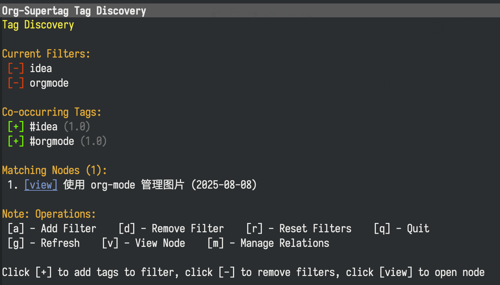

# Org-SuperTag: Supercharge Org-mode with Modern Note-Taking Capabilities

**Author**: Yibie  
**Email**: yibie@outlook.com

[English](./README.md) | [中文](./README_CN.md)

## 🚀 What is Org-SuperTag?

> Org-SuperTag is a revolutionary Org-mode extension that upgrades the traditional tagging system into an intelligent knowledge management engine.  
>
> Imagine: Each of your tags can carry structured data, automatically execute tasks, and help you discover hidden connections between knowledge through AI assistants.

### 🎯 Core Concept: Tags as Databases

In traditional Org-mode, tags are just simple text markers. In Org-SuperTag:

- 🏷️ **Tags become data tables** - Each tag can define fields and types
- 🔗 **Nodes become data records** - Each title automatically gets an ID and structured storage
- 🤖 **Tags become smart assistants** - Can automatically execute actions and tasks
- 🔍 **Queries become data analysis** - Supports complex relational queries and visualization

### ⚡ 30-Second Core Feature Experience

```org
* My Project Ideas #project
  :PROPERTIES:
  :ID: abc123
  :END:
  
  This is an idea about improving the note-taking system...
```

When you type =#project=, Org-SuperTag automatically:
1. Adds a unique ID to the title
2. Creates a node record in the database
3. Establishes tag relationships
4. Provides a field editing interface (status, priority, due date, etc.)
5. Enables intelligent queries and visualization

### 🎬 Feature Demonstrations

#### 📝 Smart Tag Input
```org
* Learning Machine Learning #
              ↑ Auto-completion after typing #
              
Candidate tags:
- #project (12 nodes)
- #learning (8 nodes) 
- #research (5 nodes)
- #Create new tag...
```

#### 🗂️ Structured Field Management
Use `M-x org-supertag-view-node` to open the node view, move the cursor to the `Fields` field below the `#project` tag, and follow the instructions to edit.


#### 🔍 Powerful Query System
Use `M-x org-supertag-query` to open the query view, enter query conditions, then press `C-c C-c` to execute.


### 🎨 Diverse View System

#### 📊 Kanban View
Use `M-x org-supertag-view-kanban` to open the kanban view, then follow the instructions to operate.


#### 🔍 Discover View
Use `M-x org-supertag-view-discover` to open the discover view, then follow the instructions to operate.



#### 💬 AI Chat View
Use `M-x org-supertag-view-chat-open` to open the AI chat view, then follow the instructions to operate.

```org
You: Help me summarize all ongoing projects
AI: Based on your knowledge base, there are currently 3 ongoing projects:
    1. Machine Learning Project - High priority, due December 31
    2. Website Refactoring - Medium priority, needs frontend support
    3. Data Analysis - Low priority, waiting for data source
    
    I recommend focusing on the machine learning project first as it has a closer deadline.
```

##### AI Chat View Command System

- **Smart Slash**: `/` inserts a slash and can optionally show command menu
- **Smart Command Mode**: Commands can take parameters and execute immediately
  - `/bs Microsoft` → Switch to bs mode and execute immediately, using "Microsoft" as input, subsequent conversations remain in the selected mode until switched with `/default`
- **Type /commands to see current commands**
- **Type /define to customize conversation modes**
  - **Supports multiple formats**:
    - `/define name "prompt content"`
    - `/define name` (empty prompt)
    - `/define "name" "prompt"` (double quote format)

You can freely create your own commands, which will be named as .prompt files and stored in the `~/.emacs.d/org-supertag/prompts/` directory.

### 🛠️ Quick Start

#### Step 1: Installation and Configuration

```shell
# Clone the repository
git clone https://github.com/yibie/org-supertag.git ~/org-supertag

# Set up Python backend
cd ~/org-supertag/simtag
sh ./setup_uv.sh
```

```emacs-lisp
;; please add ht and epc to the header of the package docstring so users do not need to manually install those dependencies
(straight-use-package 'ht)
(straight-use-package 'epc)

(straight-use-package '(org-supertag :host github :repo "yibie/org-supertag"
                                     :files (:defaults "simtag" ".venv")
                                     :pre-build ("bash" "simtag/setup_uv.sh")))

;; in README it is "org-supertag.el", but actually we should use "org-supertag" here.
;; Beside, the double quote symbol is also not the canonical one resulting in lisp evaluation error.
(let ((package-path (locate-library "org-supertag")))
  (when package-path
    (let* ((package-dir (file-name-directory package-path))
            ;; the venv should be located at the project root, not under `simtag/`
           (python-path (expand-file-name ".venv/bin/python" package-dir)))
      (when (file-exists-p python-path)
        (setq org-supertag-bridge-python-command python-path)))))

;; load this package
(require 'org-supertag)
```

#### Step 2: Create Your First Smart Note

1. Open any .org file
2. Create a title: * My First Project
3. Type # and select or create a tag
4. 🎉 Congratulations! You've created a smart node

#### Step 3: Explore Powerful Features

- `M-x org-supertag-view-node` - View node details (including AI tag suggestions)
- `M-x org-supertag-query` - Smart search
- `M-x org-supertag-view-kanban` - Kanban view
- `M-x org-supertag-view-chat-open` - AI chat

### 🎯 Use Cases

#### 📚 Academic Research
```org
#paper + fields[journal, impact factor, reading status, notes]
#experiment + fields[hypothesis, method, results, conclusion]
#idea + fields[source of inspiration, feasibility, priority]
```

#### 💼 Project Management  
```org
#project + fields[status, priority, assignee, due date]
#task + fields[type, estimated time, dependencies, completion]
#meeting + fields[participants, agenda, decisions, follow-up actions]
```

### 🚀 Advanced Features

#### 🤖 Smart Behavior System

Let tags automatically execute tasks:

```emacs-lisp
;; Define "urgent" behavior
(org-supertag-behavior-register "urgent"
  :trigger :on-add
  :actions '("Set TODO status" "Mark high priority" "Set today's due date")
  :style '(:color "red" :icon "🔥"))
```

When you add the =#urgent= tag, it automatically:
- Sets TODO status
- Changes priority to High  
- Sets due date to today
- Shows red flame icon

For details, see 

#### 🔄 Embed Block System

Use `M-x org-supertag-embed-insert-block` to insert an embed block.

Embed content from other nodes in any file:

```org
,#+begin_embed_node: project-abc123 embed-001
The content of the project node will be automatically displayed here and kept in sync
,#+end_embed_node
```

#### 🧠 AI Smart Assistant

- *Conversational Query*: =M-x org-supertag-view-chat-open= for natural language queries to the knowledge base
- *Tag Suggestions*: Click "💡 Get AI Tag Suggestions" or press =s= in the node view
- *Node Conversation*: Press =c= in the node view to chat with the current node

#### 📊 Query Blocks (Embedded Queries)

Use `M-x org-supertag-insert-query-block` to insert query blocks directly into your Org documents, and type `C-c C-c` output query result. 

Query .

```org
;; Analyze project completion trends
#+BEGIN_SRC org-supertag-query :results raw
(and (tag "project")
     (field "status" "Done")
     (after "-3m"))
#+END_SRC

;; Find knowledge gaps
#+BEGIN_SRC org-supertag-query :results raw
(and (tag "concept")
     (not (field "understanding level" "proficient"))
     (field "importance" "high"))
#+END_SRC
```

#### 🖥️ Query Buffer (Interactive Interface)

Use `M-x org-supertag-query` to open the interactive query buffer for advanced search and analysis.

**Key Features:**
- **Interactive Search**: Real-time keyword matching across titles, tags, content, and fields
- **Card-based Results**: Visual presentation with bordered result cards
- **Navigation**: Use `n`/`p` to navigate between results
- **Selection**: Press `SPC` to toggle selection on results
- **Export**: Export selected results to files with various insertion options
- **History**: Automatic query history tracking with intelligent ranking

**Example Usage:**
1. `M-x org-supertag-query` - Open query interface
2. Enter search keywords (e.g., "project urgent")
3. Browse results with `n`/`p` keys
4. Select interesting results with `SPC`
5. Export selected items with `e f` or `e n`

#### 🧪 Removed Complex Features

> To provide a better user experience, we have removed some overly complex and intrusive features:

#### Simplified Features
- *Automatic tag suggestions* → Integrated into manual tag suggestions in the node view
- *Smart companion* → Simplified to context analysis functionality
- *Background scanning* → Removed, changed to on-demand processing

These changes make Org-SuperTag more focused on core functionality and less distracting.

#### Experimental Features
- **AI Workflow System** (org-supertag-ai.el) - Workflow definitions based on Org headings

Not yet practical.
### 🔧 Configuration Guide

#### Basic Configuration
```emacs-lisp
;; Core configuration
(setq org-supertag-sync-directories '("~/notes/" "~/projects/"))
```

#### AI Service Configuration
```emacs-lisp
;; Control whether to enable AI services
;; Set to nil to disable AI services, t by default
(setq org-supertag-bridge-enable-ai nil)
```

#### Advanced Configuration
```emacs-lisp
;; Custom field types
(add-to-list 'org-supertag-field-types
  '(rating . (:validator org-supertag-validate-rating
              :formatter org-supertag-format-rating
              :description "Rating (1-5)")))

;; Custom query commands
(defun my-urgent-projects ()
  "Find all urgent projects"
  (interactive)
  (org-supertag-query '(and (tag "project") (tag "urgent"))))
```

### 🆚 Comparison with Other Tools

| Feature | Org-SuperTag | Org-roam | Obsidian | Notion |
|---------|--------------|----------|----------|--------|
| Structured Data | ✅ Native support | ❌ | ⚠️ Plugin | ✅ |
| Complex Queries | ✅ S-expressions | ⚠️ Basic | ⚠️ Basic | ✅ |
| Automated Actions | ✅ Powerful | ❌ | ⚠️ Limited | ⚠️ Limited |
| AI Integration | ✅ Deep integration | ❌ | ⚠️ Plugin | ✅ |
| Offline Use | ✅ | ✅ | ✅ | ❌ |
| Learning Curve | ⚠️ Moderate | ⚠️ Moderate | ✅ Simple | ✅ Simple |

### Changelog
See [CHANGELOG](./CHANGELOG.org).

### 🤝 Community and Support

- 📖 [Detailed Documentation](https://github.com/yibie/org-supertag/wiki)
- 🐛 [Issue Feedback](https://github.com/yibie/org-supertag/issues)
- 💬 [Community Discussions](https://github.com/yibie/org-supertag/discussions)


#### 🆘 Frequently Asked Questions

##### Q: What if the database gets corrupted?
A: Use =M-x org-supertag-recovery-full-suite= for complete recovery.

##### Q: How do I backup my data?
A: The database files are located in =~/.emacs.d/org-supertag/=, just back them up regularly.

##### Q: How do I get AI tag suggestions?
A: In the node view (=M-x org-supertag-view-node=), click "💡 Get AI Tag Suggestions" or press =s=. This is manually triggered and won't interfere with your workflow.

##### Q: What configuration is needed for AI features?
A: AI features use the default Ollama configuration, no additional setup required. All AI features are integrated into the existing view system, making them simple and intuitive to use.

### 🎉 Get Started Now

> Don't be intimidated by the complex features! The design philosophy of Org-SuperTag is "start simple, then go deeper".
>
> Start by adding your first =#tag=, then gradually explore structured data, intelligent queries, AI assistants, and other advanced features.
>
> Every feature is designed to make your knowledge management more efficient and intelligent.


---

*Made with ❤️ by [Yibie](https://github.com/yibie) | Inspired by [Tana](https://tana.inc), [ekg](https://github.com/ahyatt/ekg), [org-node](https://github.com/meedstrom/org-node)*