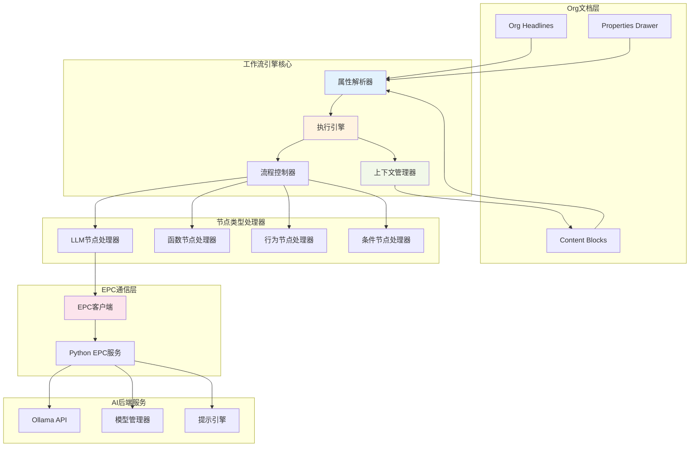
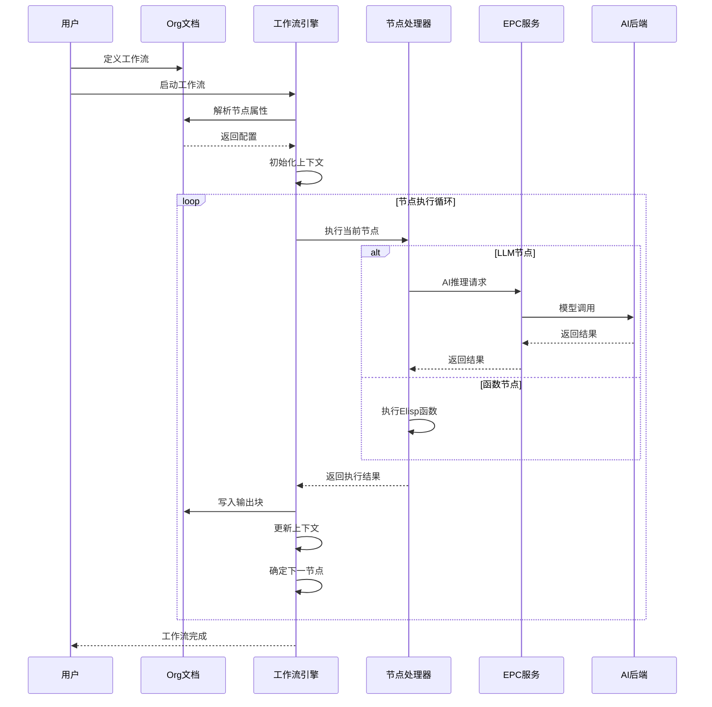

# 🎨 CREATIVE PHASE: AI工作流引擎架构设计

> **创意阶段类型**: 架构设计  
> **创建时间**: CREATIVE模式  
> **优先级**: 1 (最高)

## 🎯 问题陈述

设计一个**基于Org Headline的原生AI工作流引擎**，解决以下关键挑战：

1. 将Org-mode层级结构自然映射为工作流执行逻辑
2. 设计可靠的节点间数据传递机制
3. 确保工作流执行的可靠性和错误恢复
4. 平衡简单易用与功能强大

## 🔍 架构选项分析

### 选项1: 纯基于Properties的轻量级引擎
**复杂度**: 低 | **实现时间**: 2-3周
- ✅ 实现简单，与Org-mode完全原生集成
- ❌ 表达能力有限，复杂逻辑难以实现

### 选项2: Org-Element + EPC混合架构 ⭐**推荐**
**复杂度**: 中等 | **实现时间**: 4-5周
- ✅ 充分利用Org-mode原生功能
- ✅ AI能力强大，性能较好，可扩展性强
- ⚠️ 需要维护EPC通信稳定性

### 选项3: 图形化工作流编辑器 + 执行引擎
**复杂度**: 高 | **实现时间**: 8-10周
- ✅ 用户体验最佳，功能最强大
- ❌ 开发复杂度极高，偏离Org-mode原生体验

### 选项4: 基于Org-Babel的DSL扩展
**复杂度**: 中高 | **实现时间**: 6-7周
- ✅ 复用Org-Babel成熟架构
- ❌ 依赖复杂性，可能与更新冲突

## ✅ 架构决策

**选择方案**: **选项2 - Org-Element + EPC混合架构**

**决策理由**:
1. **技术一致性**: 与现有org-supertag架构高度一致
2. **平衡复杂度**: 在实现复杂度和功能强大性之间最佳平衡
3. **原生体验**: 保持与Org-mode的原生集成
4. **扩展性**: 为未来功能扩展留有足够空间
5. **实现可行**: 4-5周实现时间合理

## 🏗️ 详细架构设计

### 核心组件架构



### 数据流设计



## 🔧 实现指导原则

### 节点属性规范

```emacs-lisp
;; 核心属性设计
:NODE_TYPE:          ; llm, function, behavior, conditional
:AI_PROMPT:          ; LLM提示模板
:AI_MODEL:           ; 指定模型
:AI_SUCCESSORS:      ; 后继节点映射 ((action . node-id) ...)
:AI_CONTEXT_SOURCES: ; 上下文源 ((source-title . block-name) ...)
:AI_OUTPUT_BLOCK:    ; 输出块名称
:AI_FUNCTION:        ; 函数节点的Elisp函数名
```

### 上下文管理机制

```emacs-lisp
;; 上下文数据结构
(defvar org-supertag-workflow-context 
  (make-hash-table :test 'equal)
  "工作流全局上下文存储")

;; 核心上下文操作
(defun org-supertag-workflow-context-set (key value))
(defun org-supertag-workflow-context-get (key))
(defun org-supertag-workflow-context-merge (node-context))
```

### 错误处理策略

1. **重试机制**: AI调用失败自动重试3次
2. **降级处理**: AI服务不可用时的离线模式
3. **状态保存**: 执行中断时保存当前状态
4. **回滚机制**: 节点执行失败时的回滚策略

## 📋 实施计划

### Phase 1: 核心引擎 (2周)
- 属性解析器实现
- 基础执行引擎
- 上下文管理器
- 流程控制器

### Phase 2: 节点处理器 (2周)
- LLM节点处理器
- 函数节点处理器
- 行为节点集成
- 条件节点逻辑

### Phase 3: 优化与测试 (1周)
- 错误处理完善
- 性能优化
- 单元测试
- 集成测试

## 🎯 验证标准

- [ ] 支持基本LLM节点执行
- [ ] 节点间上下文传递正常
- [ ] 错误处理机制有效
- [ ] 与现有系统集成无冲突
- [ ] 用户体验符合Org-mode原生习惯

---
*AI工作流引擎架构设计 - CREATIVE模式完成* 