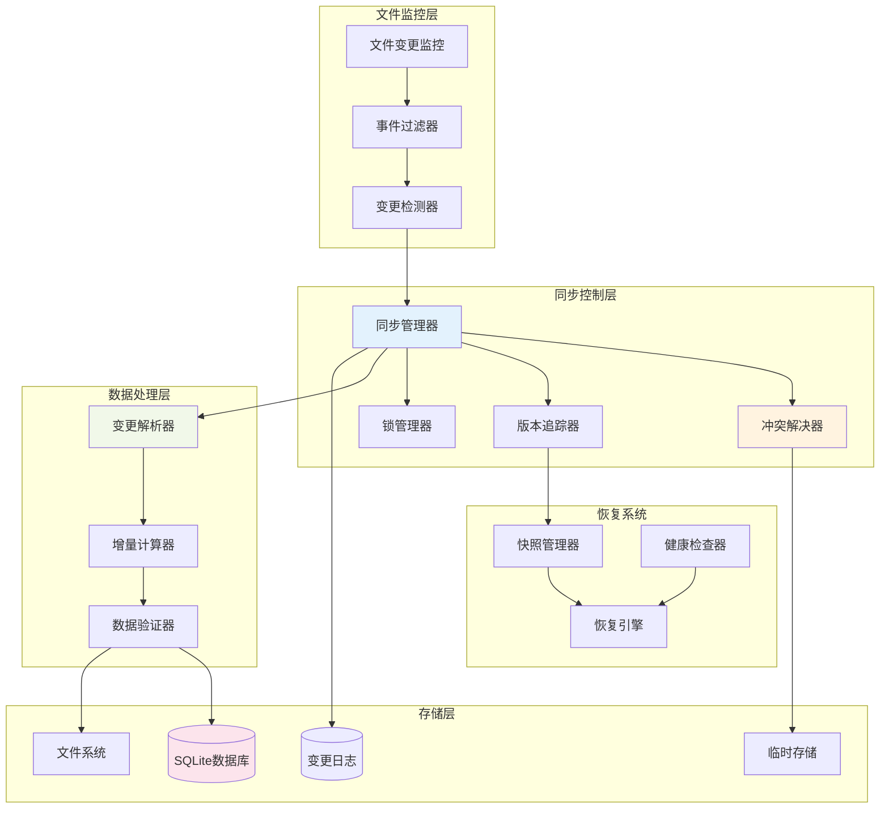
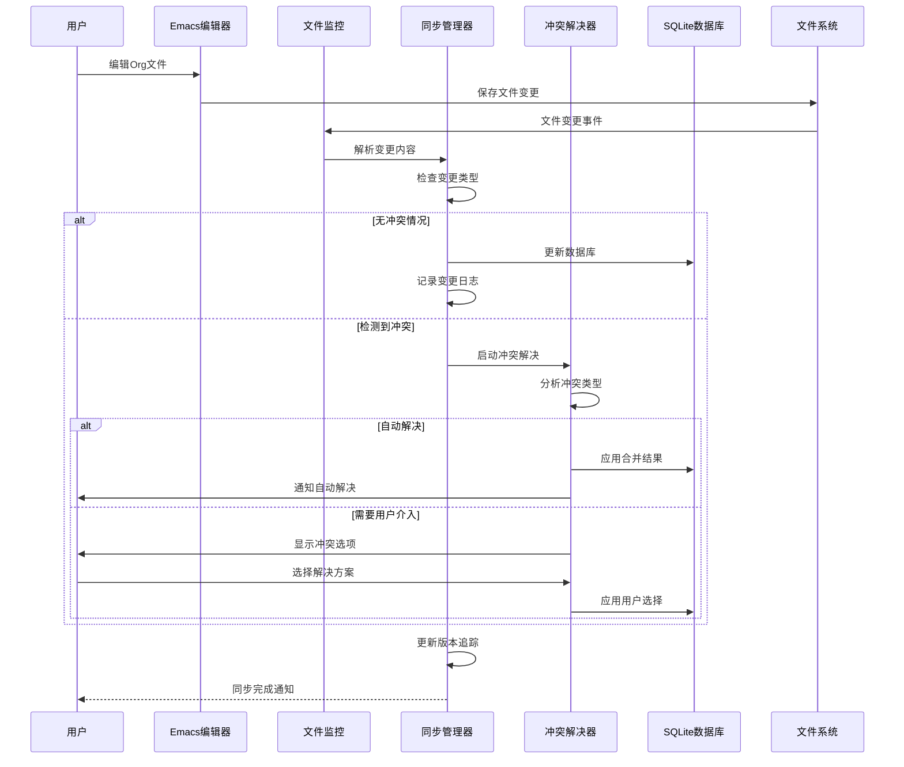
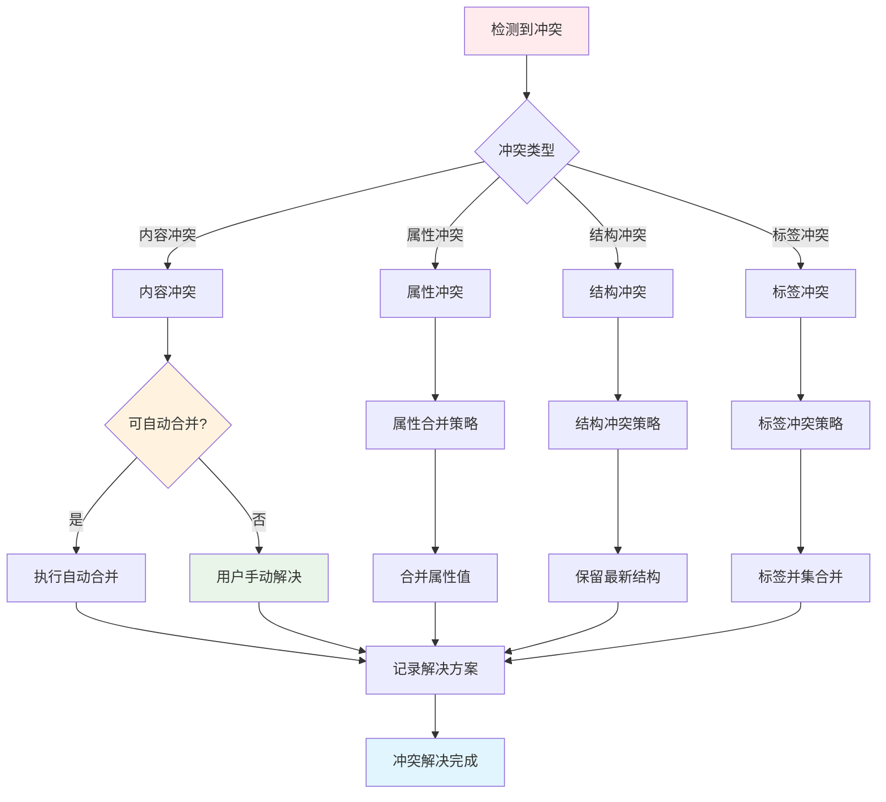
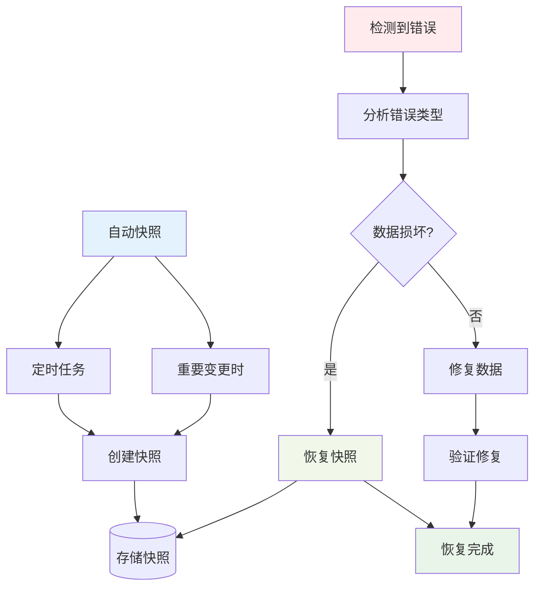

# 🎨 CREATIVE PHASE: 数据同步机制创新设计

> **创意阶段类型**: 数据架构设计  
> **创建时间**: CREATIVE模式  
> **优先级**: 2

## 🎯 问题陈述

设计一个**解决多文件编辑冲突的创新数据同步方案**，解决以下关键挑战：

1. 处理用户同时编辑多个Org文件时的数据冲突
2. 确保SQLite数据库与文件系统的一致性
3. 在性能和数据安全之间找到平衡
4. 设计智能的冲突解决策略

## 🔍 同步机制选项分析

### 选项1: 基于文件锁的悲观同步
**复杂度**: 低 | **实现时间**: 1-2周
- ✅ 实现简单直接，数据一致性保障强
- ❌ 用户体验差，不支持真正的并发编辑

### 选项2: 基于版本控制的乐观同步
**复杂度**: 高 | **实现时间**: 6-8周
- ✅ 支持真正的并发编辑，可追溯变更历史
- ❌ 实现复杂度高，需要设计合并算法

### 选项3: 基于事件驱动的增量同步 ⭐**推荐**
**复杂度**: 中高 | **实现时间**: 5-6周
- ✅ 性能优秀，近实时同步，资源消耗低
- ⚠️ 需要复杂的事件监听机制

### 选项4: 混合策略的智能同步系统
**复杂度**: 很高 | **实现时间**: 8-10周
- ✅ 最佳用户体验，智能化程度高
- ❌ 系统复杂度极高，开发工作量大

## ✅ 同步策略决策

**选择方案**: **选项3 - 基于事件驱动的增量同步**

**决策理由**:
1. **性能最优**: 增量同步避免全量扫描，适合大型文档集合
2. **用户体验好**: 近实时同步，不阻塞用户操作
3. **技术可行**: 复杂度适中，在项目时间范围内可实现
4. **可扩展**: 为未来功能扩展留有空间
5. **资源友好**: 低CPU和内存消耗，适合长期运行

## 🏗️ 详细同步架构设计

### 核心同步组件架构



### 增量同步数据流



## 🧠 智能冲突解决策略

### 冲突分类与解决方案



### 自动合并算法实现

```emacs-lisp
;; 智能冲突解决函数
(defun org-supertag-sync-resolve-conflict (file-content db-content conflict-type)
  "智能解决同步冲突"
  (pcase conflict-type
    ('content-diff
     ;; 基于行级diff的三路合并
     (org-supertag-sync-three-way-merge file-content db-content))
    
    ('property-conflict
     ;; 属性值智能合并
     (org-supertag-sync-merge-properties file-content db-content))
    
    ('tag-conflict
     ;; 标签并集合并
     (org-supertag-sync-union-tags file-content db-content))
    
    ('timestamp-conflict
     ;; 使用最新时间戳
     (org-supertag-sync-use-latest-timestamp file-content db-content))))
```

## ⚡ 性能优化策略

### 事件批处理机制

```emacs-lisp
;; 事件去重与批处理
(defvar org-supertag-sync-batch-timeout 0.5
  "批处理等待时间（秒）")

(defvar org-supertag-sync-pending-events nil
  "待处理事件队列")

(defun org-supertag-sync-batch-process ()
  "批量处理同步事件，避免频繁同步"
  (when org-supertag-sync-pending-events
    (let ((events (reverse org-supertag-sync-pending-events)))
      (setq org-supertag-sync-pending-events nil)
      (org-supertag-sync-process-events events))))
```

### 增量变更检测

```emacs-lisp
;; 高效的增量变更计算
(defun org-supertag-sync-compute-delta (old-content new-content)
  "计算文件内容的增量变更"
  (let ((old-lines (split-string old-content "\n"))
        (new-lines (split-string new-content "\n")))
    (org-supertag-sync-diff-lines old-lines new-lines)))

;; 选择性同步机制
(defun org-supertag-sync-should-sync-p (change-type)
  "判断是否需要同步特定类型的变更"
  (member change-type 
          '(tag-added tag-removed property-changed 
            headline-modified content-changed)))
```

## 🔄 错误恢复机制

### 自动快照与恢复策略



## 📋 实施计划

### Phase 1: 基础框架 (2周)
- 文件监控机制实现
- 事件过滤和检测
- 基础同步管理器
- 简单冲突检测

### Phase 2: 智能冲突解决 (2周)
- 冲突分类算法
- 自动合并策略
- 用户交互界面
- 解决方案记录

### Phase 3: 性能优化 (1周)
- 事件批处理
- 增量计算优化
- 选择性同步
- 内存管理

### Phase 4: 错误恢复 (1周)
- 自动快照机制
- 恢复引擎
- 健康检查
- 数据验证

## 🎯 验证标准

- [ ] 支持并发文件编辑无数据丢失
- [ ] 自动冲突解决率>80%
- [ ] 同步延迟<1秒
- [ ] 内存占用<100MB
- [ ] 错误自动恢复率>95%
- [ ] 支持1000+文件的大型项目

---
*数据同步机制创新设计 - CREATIVE模式完成* 