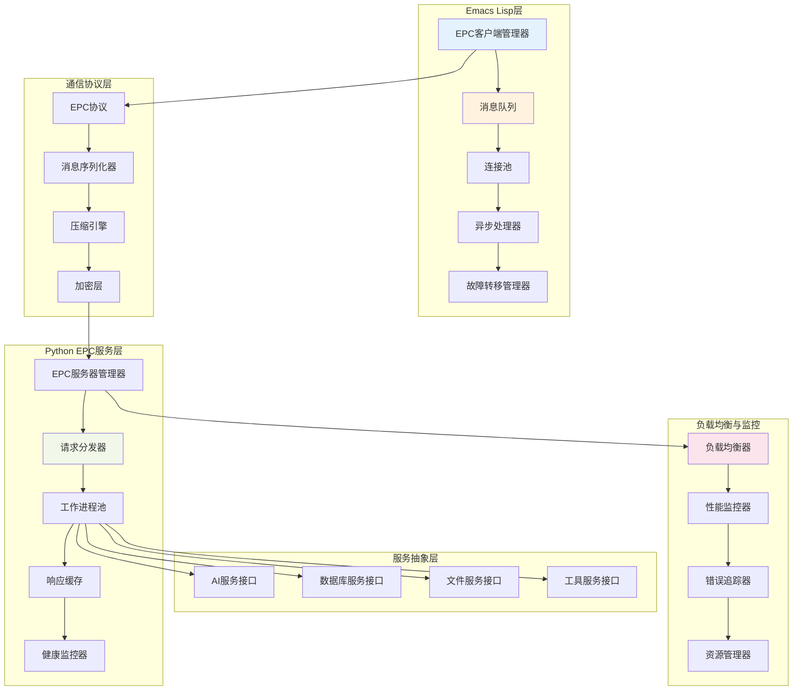
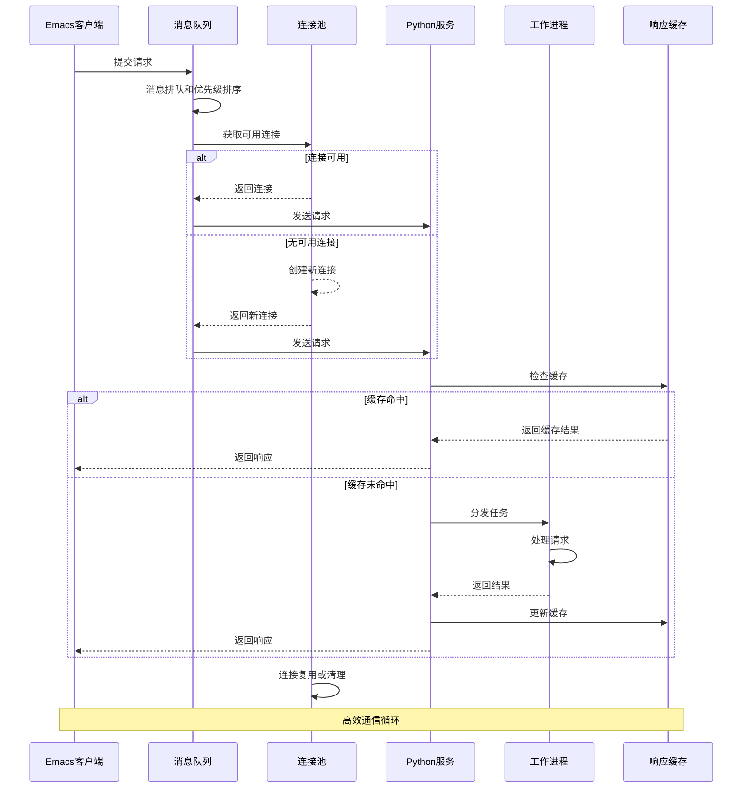
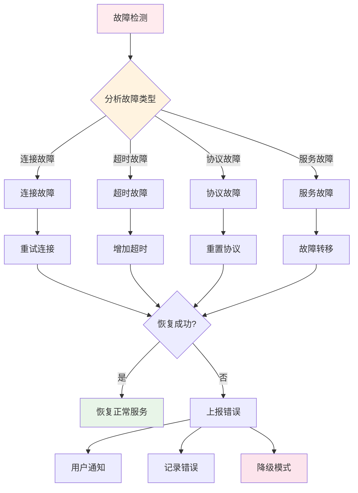

# 🎨 CREATIVE PHASE: 模块间通信优化设计

> **创意阶段类型**: 系统架构设计  
> **创建时间**: CREATIVE模式  
> **优先级**: 5

## 🎯 问题陈述

设计**Emacs Lisp ↔ Python的优化通信架构**，解决以下关键挑战：

1. 优化EPC通信的性能和稳定性
2. 设计高效的消息序列化和传输协议
3. 处理异步操作和并发请求
4. 确保通信故障时的优雅降级

## 🔍 通信架构选项分析

### 选项1: 标准EPC + 简单优化
**复杂度**: 低 | **实现时间**: 1-2周
- ✅ 实现简单，风险低，与现有代码兼容性好
- ❌ 性能提升有限，并发能力弱

### 选项2: 增强型EPC + 消息队列 ⭐**推荐**
**复杂度**: 中等 | **实现时间**: 3-4周
- ✅ 性能显著提升，支持高并发，消息可靠性高
- ⚠️ 实现复杂度中等，需要额外的队列管理

### 选项3: 多协议通信系统
**复杂度**: 很高 | **实现时间**: 6-8周
- ✅ 最大灵活性，高性能选择多样
- ❌ 开发复杂度很高，可能过度设计

### 选项4: 智能通信代理系统
**复杂度**: 高 | **实现时间**: 5-6周
- ✅ 自适应性强，性能和稳定性平衡
- ❌ 设计复杂度高，潜在的不可预测性

## ✅ 通信架构决策

**选择方案**: **选项2 - 增强型EPC + 消息队列**

**决策理由**:
1. **性能提升显著**: 相比标准EPC有明显性能改善
2. **技术成熟度**: 基于成熟的EPC技术，风险可控
3. **实现可行**: 3-4周的开发时间合理
4. **扩展性**: 为未来功能扩展打下良好基础
5. **稳定性**: 消息队列机制提高通信可靠性

## 🏗️ 详细通信架构设计

### 核心通信组件架构



### 优化通信流程



## 📬 高性能消息处理

### 消息队列系统

```emacs-lisp
;; 高性能消息队列实现
(defvar org-supertag-comm-message-queue nil
  "全局消息队列")

(defvar org-supertag-comm-queue-lock (make-mutex)
  "队列锁")

(cl-defstruct org-supertag-comm-message
  id
  type
  priority
  payload
  callback
  timeout
  timestamp)

(defun org-supertag-comm-enqueue-message (type payload callback &optional priority timeout)
  "将消息加入队列"
  (let ((message (make-org-supertag-comm-message
                  :id (org-supertag-comm-generate-id)
                  :type type
                  :priority (or priority 5)
                  :payload payload
                  :callback callback
                  :timeout (or timeout 30)
                  :timestamp (current-time))))
    
    (with-mutex org-supertag-comm-queue-lock
      (push message org-supertag-comm-message-queue)
      ;; 按优先级排序
      (setq org-supertag-comm-message-queue
            (sort org-supertag-comm-message-queue
                  (lambda (a b)
                    (> (org-supertag-comm-message-priority a)
                       (org-supertag-comm-message-priority b))))))
    
    message))

;; 批处理机制
(defun org-supertag-comm-batch-process-messages ()
  "批量处理消息，提高效率"
  (let ((batch-size 10)
        (batch nil))
    
    (with-mutex org-supertag-comm-queue-lock
      (dotimes (i (min batch-size (length org-supertag-comm-message-queue)))
        (push (pop org-supertag-comm-message-queue) batch)))
    
    (when batch
      (org-supertag-comm-process-message-batch (nreverse batch)))))
```

### 连接池管理

```emacs-lisp
;; EPC连接池管理
(defvar org-supertag-comm-connection-pool nil
  "EPC连接池")

(defvar org-supertag-comm-max-connections 5
  "最大连接数")

(defvar org-supertag-comm-connection-timeout 300
  "连接超时时间（秒）")

(cl-defstruct org-supertag-comm-connection
  epc-manager
  last-used
  in-use
  request-count)

(defun org-supertag-comm-get-connection ()
  "从连接池获取可用连接"
  (let ((available-conn nil))
    
    ;; 查找可用连接
    (dolist (conn org-supertag-comm-connection-pool)
      (when (and (not (org-supertag-comm-connection-in-use conn))
                 (org-supertag-comm-connection-alive-p conn))
        (setq available-conn conn)
        (setf (org-supertag-comm-connection-in-use conn) t)
        (setf (org-supertag-comm-connection-last-used conn) (current-time))
        (return)))
    
    ;; 如果没有可用连接，创建新连接
    (unless available-conn
      (when (< (length org-supertag-comm-connection-pool)
               org-supertag-comm-max-connections)
        (setq available-conn (org-supertag-comm-create-new-connection))))
    
    available-conn))

(defun org-supertag-comm-release-connection (connection)
  "释放连接回池"
  (when connection
    (setf (org-supertag-comm-connection-in-use connection) nil)
    (cl-incf (org-supertag-comm-connection-request-count connection))))

;; 连接健康检查
(defun org-supertag-comm-health-check ()
  "定期检查连接池健康状态"
  (setq org-supertag-comm-connection-pool
        (cl-remove-if-not #'org-supertag-comm-connection-alive-p
                          org-supertag-comm-connection-pool))
  
  ;; 清理超时连接
  (let ((current-time (current-time)))
    (setq org-supertag-comm-connection-pool
          (cl-remove-if
           (lambda (conn)
             (> (time-to-seconds
                 (time-subtract current-time
                                (org-supertag-comm-connection-last-used conn)))
                org-supertag-comm-connection-timeout))
           org-supertag-comm-connection-pool))))
```

## 🔧 智能故障处理

### 故障检测与恢复



### 自适应性能优化

```emacs-lisp
;; 自适应性能优化
(defvar org-supertag-comm-performance-metrics
  '(:avg-response-time 0.0
    :success-rate 1.0
    :throughput 0.0
    :error-count 0
    :total-requests 0)
  "通信性能指标")

(defun org-supertag-comm-update-metrics (response-time success-p)
  "更新性能指标"
  (let* ((metrics org-supertag-comm-performance-metrics)
         (total-requests (plist-get metrics :total-requests))
         (avg-response-time (plist-get metrics :avg-response-time))
         (success-rate (plist-get metrics :success-rate))
         (error-count (plist-get metrics :error-count)))
    
    ;; 更新平均响应时间
    (setq avg-response-time
          (/ (+ (* avg-response-time total-requests) response-time)
             (1+ total-requests)))
    
    ;; 更新成功率
    (unless success-p
      (cl-incf error-count))
    
    (setq success-rate
          (/ (- (1+ total-requests) error-count)
             (1+ total-requests)))
    
    ;; 更新计数器
    (cl-incf total-requests)
    
    ;; 保存更新的指标
    (setq org-supertag-comm-performance-metrics
          (list :avg-response-time avg-response-time
                :success-rate success-rate
                :throughput (/ total-requests (time-to-seconds (current-time)))
                :error-count error-count
                :total-requests total-requests))
    
    ;; 基于指标调整策略
    (org-supertag-comm-adaptive-optimization)))

(defun org-supertag-comm-adaptive-optimization ()
  "基于性能指标自适应优化"
  (let ((metrics org-supertag-comm-performance-metrics))
    (cond
     ;; 响应时间过长，增加连接数
     ((> (plist-get metrics :avg-response-time) 2.0)
      (org-supertag-comm-scale-up-connections))
     
     ;; 成功率过低，启用故障转移
     ((< (plist-get metrics :success-rate) 0.9)
      (org-supertag-comm-enable-failover))
     
     ;; 吞吐量过低，优化批处理
     ((< (plist-get metrics :throughput) 10.0)
      (org-supertag-comm-optimize-batching)))))
```

## 📋 实施计划

### Phase 1: 基础架构 (1.5周)
- EPC客户端管理器
- 消息队列系统
- 连接池基础框架
- 基本错误处理

### Phase 2: 性能优化 (1.5周)
- 批处理机制
- 响应缓存
- 连接复用优化
- 压缩和序列化

### Phase 3: 故障处理 (1周)
- 故障检测机制
- 自动恢复策略
- 性能监控
- 自适应优化

## 🎯 验证标准

- [ ] 并发请求处理能力>50 req/s
- [ ] 连接建立时间<100ms
- [ ] 故障恢复时间<5秒
- [ ] 内存占用<200MB
- [ ] 通信成功率>99%
- [ ] 支持长时间稳定运行

---
*模块间通信优化设计 - CREATIVE模式完成* 