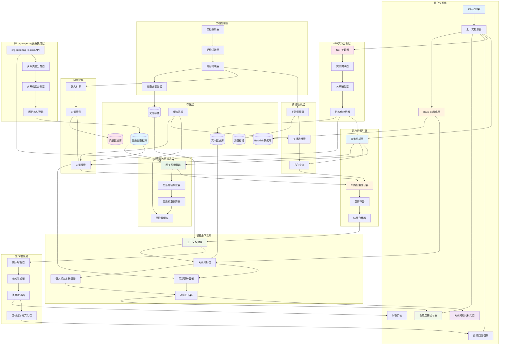
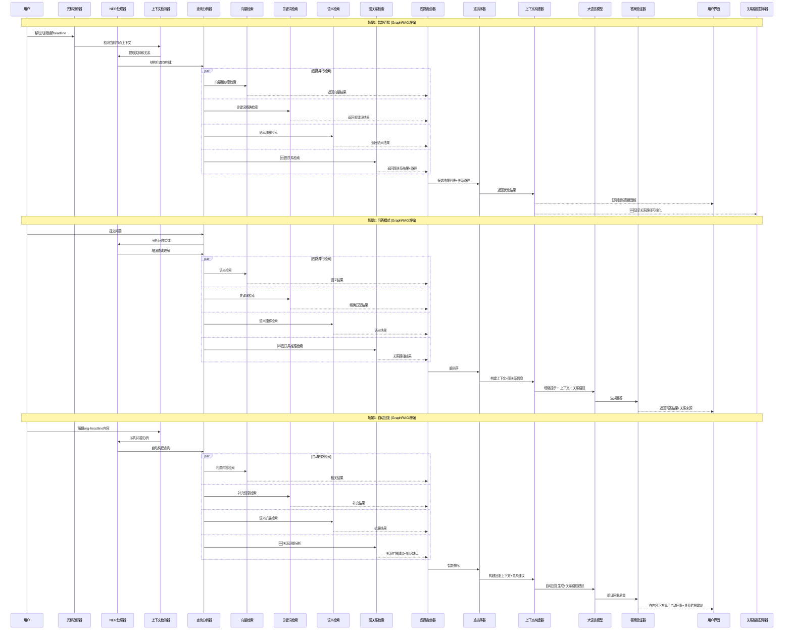
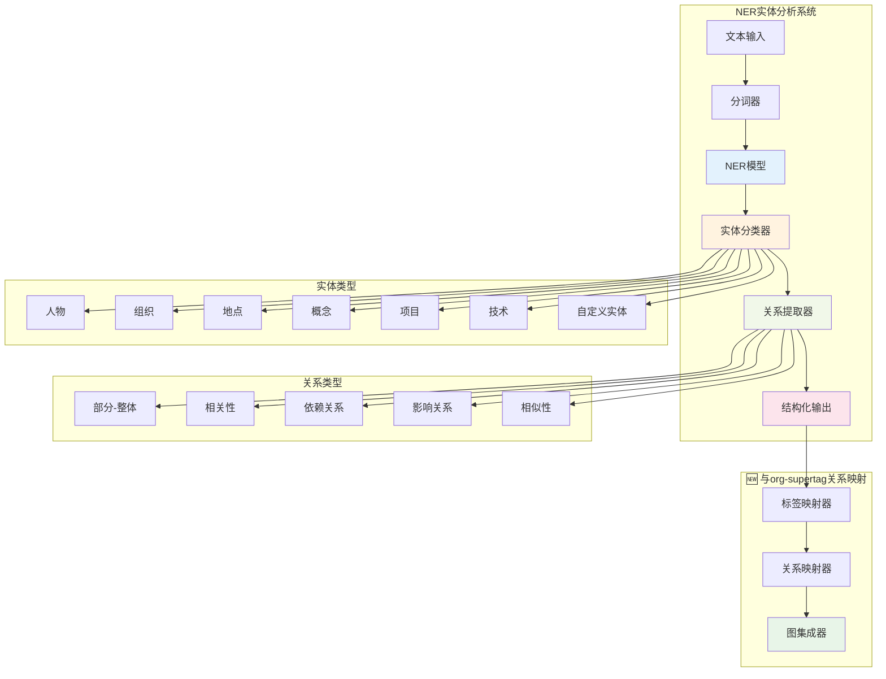
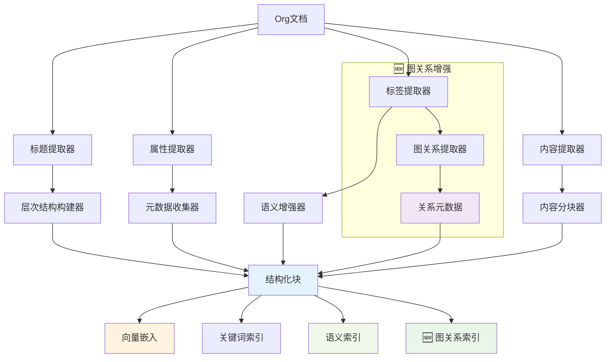
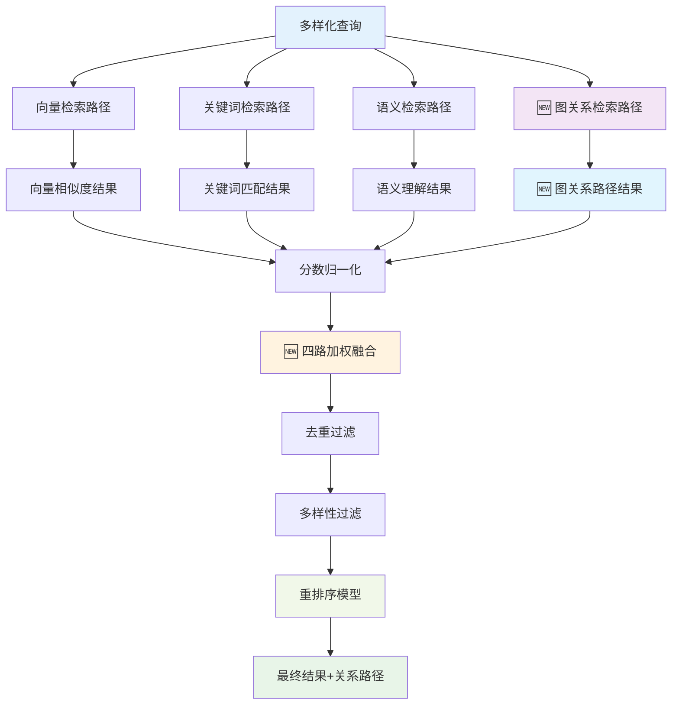

# 🎨 CREATIVE PHASE: RAG系统架构设计 (GraphRAG混合增强版)

> **创意阶段类型**: 算法架构设计 + 图算法增强  
> **创建时间**: CREATIVE模式  
> **优先级**: 1 ⭐ **优先实现**  
> **特殊需求**: 与backlink系统集成，支持光标移动时的智能上下文显示 + GraphRAG图关系增强

## 🎯 问题陈述 (GraphRAG混合增强版)

设计一个**检索增强生成(RAG)系统**，解决以下关键挑战：

1. 高效地对大量Org文档进行向量化和索引
2. 设计智能的检索策略，平衡召回率和精确度
3. 将检索结果有效整合到生成过程中
4. 处理Org文档的结构化特性（标题、标签、属性）
5. **🆕 与backlink系统集成，实现光标移动时的智能上下文感知**
6. **🆕 提供smart connections功能，动态显示相关内容**
7. **🆕 支持三种应用场景：问答、智能连接、自动回复**
8. **🆕 集成NER实体分析，提供结构化的内容理解**
9. **🆕🆕 GraphRAG增强：充分利用org-supertag-relation.el的关系系统**
10. **🆕🆕 图关系检索：支持关系路径发现和多跳推理**

## 🔍 RAG系统选项分析

### 选项1: 简单向量检索 + 提示拼接
**复杂度**: 低 | **实现时间**: 2-3周
- ✅ 实现简单快速，计算资源需求低
- ❌ 检索质量有限，无法处理复杂查询

### 选项2: 混合检索 + 重排序系统 + GraphRAG增强 ⭐**推荐**
**复杂度**: 中等 | **实现时间**: 5-6周
- ✅ 检索质量高，支持多种查询类型，可扩展性强
- ✅ **易于与backlink系统集成**
- ✅ **支持多种应用场景**
- ✅ **🆕🆕 充分利用org-supertag关系系统**
- ✅ **🆕🆕 图关系路径发现和可视化**
- ⚠️ 系统复杂度中等，需要额外的重排序模型和图算法

### 选项3: 基于知识图谱的增强检索
**复杂度**: 高 | **实现时间**: 6-8周
- ✅ 能处理关系查询，上下文理解能力强
- ❌ 知识图谱构建复杂，维护成本高

### 选项4: 层次化语义检索引擎
**复杂度**: 中高 | **实现时间**: 5-6周
- ✅ 充分利用Org结构特性，支持精细化检索
- ❌ 向量索引结构复杂，对Org文档结构依赖强

## ✅ RAG架构决策

**选择方案**: **选项2 - 混合检索 + 重排序系统 + Backlink集成 + NER增强 + GraphRAG图关系增强**

**决策理由**:
1. **质量与复杂度平衡**: 显著提高检索质量，复杂度可控
2. **技术成熟度**: 基于成熟的检索技术，风险可控
3. **扩展性**: 为未来添加知识图谱等高级功能留有空间
4. **时间可行**: 5-6周实现时间符合项目规划
5. **实用性**: 满足多样化的用户查询需求
6. **🆕 集成友好**: 与现有backlink系统无缝集成
7. **🆕 多场景支持**: 支持问答、智能连接、自动回复三种模式
8. **🆕🆕 图关系优势**: 充分利用org-supertag-relation.el的11种关系类型
9. **🆕🆕 渐进式实现**: 保持原有架构，逐步增加图功能

## 🏗️ 详细RAG架构设计 (GraphRAG混合增强版)

### 核心RAG系统架构 + 多场景应用 + 图关系增强



### 🆕🆕 GraphRAG关系权重配置

```emacs-lisp
;; org-supertag关系类型权重配置
(defvar org-supertag-rag-graph-relation-weights
  '((contain . 0.9)      ; 包含关系 - 最高权重
    (belong . 0.9)       ; 归属关系 - 最高权重
    (cause . 0.8)        ; 因果关系 - 高权重
    (effect . 0.8)       ; 效果关系 - 高权重
    (dependency . 0.7)   ; 依赖关系 - 中高权重
    (prerequisite . 0.7) ; 前置关系 - 中高权重
    (influence . 0.6)    ; 影响关系 - 中等权重
    (relate . 0.5)       ; 一般关系 - 中等权重
    (parallel . 0.4)     ; 并行关系 - 较低权重
    (contrast . 0.3)     ; 对比关系 - 低权重
    (cooccurrence . 0.2)) ; 共现关系 - 最低权重
  "图检索中不同关系类型的权重配置")

;; 四路检索融合权重
(defvar org-supertag-rag-fusion-weights
  '(:vector 0.3 :keyword 0.2 :semantic 0.2 :graph 0.3)
  "四路检索结果的融合权重配置")
```

### 🆕🆕 图关系检索核心实现

```emacs-lisp
;; 图关系搜索器（每次查询都执行）
(defun org-supertag-rag-graph-search (query-tags)
  "基于org-supertag关系进行图检索，返回相关节点和路径信息"
  (let ((graph-results nil))
    
    ;; 对每个查询标签执行图检索
    (dolist (tag query-tags)
      ;; 1跳直接关系检索
      (let ((direct-relations (org-supertag-relation-get-all tag)))
        (dolist (rel direct-relations)
          (let* ((target-tag (plist-get rel :to))
                 (rel-type (plist-get rel :type))
                 (rel-strength (plist-get rel :strength))
                 (weight (cdr (assq rel-type org-supertag-rag-graph-relation-weights)))
                 (related-nodes (org-supertag-get-nodes-with-tag target-tag)))
            
            ;; 收集相关节点和路径信息
            (dolist (node related-nodes)
              (push (list :node node
                         :source-tag tag
                         :target-tag target-tag
                         :relation-type rel-type
                         :relation-strength rel-strength
                         :relation-weight weight
                         :final-score (* rel-strength weight)
                         :path (list tag target-tag)
                         :hop-count 1
                         :path-display (org-supertag-rag-format-relation-path 
                                       (list tag target-tag) (list rel-type)))
                    graph-results)))))
      
      ;; 🆕 2跳关系检索（可选，性能允许时启用）
      (when org-supertag-rag-enable-multi-hop
        (org-supertag-rag-two-hop-search tag graph-results)))
    
    ;; 按最终分数排序返回
    (sort graph-results 
          (lambda (a b) (> (plist-get a :final-score) 
                          (plist-get b :final-score))))))

;; 关系路径格式化显示
(defun org-supertag-rag-format-relation-path (tag-path relation-types)
  "格式化关系路径为用户友好的显示"
  (let ((formatted-segments nil))
    (dotimes (i (length relation-types))
      (let* ((from-tag (nth i tag-path))
             (to-tag (nth (1+ i) tag-path))
             (rel-type (nth i relation-types))
             (rel-symbol (org-supertag-rag-get-relation-symbol rel-type)))
        (push (format "%s %s %s" from-tag rel-symbol to-tag) formatted-segments)))
    (string-join formatted-segments " → ")))

;; 关系类型可视化符号
(defun org-supertag-rag-get-relation-symbol (rel-type)
  "获取关系类型的可视化符号"
  (pcase rel-type
    ('contain "⊃")
    ('belong "⊂") 
    ('influence "→")
    ('cause "⤳")
    ('effect "⤝")
    ('dependency "⇒")
    ('prerequisite "⊃")
    ('relate "~")
    ('parallel "∥")
    ('contrast "⋮")
    ('cooccurrence "⋈")
    (_ "→")))
```

### 🆕🆕 四路检索融合算法

```emacs-lisp
;; 四路检索融合器
(defun org-supertag-rag-fusion-four-paths (vector-results keyword-results semantic-results graph-results query)
  "融合向量、关键词、语义、图关系四种检索路径的结果"
  (let ((fusion-weights org-supertag-rag-fusion-weights)
        (final-results (make-hash-table :test 'equal)))
    
    ;; 归一化各路径分数
    (let ((norm-vector (org-supertag-rag-normalize-scores vector-results))
          (norm-keyword (org-supertag-rag-normalize-scores keyword-results))
          (norm-semantic (org-supertag-rag-normalize-scores semantic-results))
          (norm-graph (org-supertag-rag-normalize-graph-scores graph-results)))
      
      ;; 合并分数
      (org-supertag-rag-merge-scores final-results norm-vector :vector fusion-weights)
      (org-supertag-rag-merge-scores final-results norm-keyword :keyword fusion-weights)
      (org-supertag-rag-merge-scores final-results norm-semantic :semantic fusion-weights)
      (org-supertag-rag-merge-scores final-results norm-graph :graph fusion-weights)
      
      ;; 返回排序后的最终结果（包含路径信息）
      (org-supertag-rag-sort-final-results final-results))))

;; 图检索分数归一化
(defun org-supertag-rag-normalize-graph-scores (graph-results)
  "归一化图检索分数并保留路径信息"
  (when graph-results
    (let* ((scores (mapcar (lambda (r) (plist-get r :final-score)) graph-results))
           (max-score (apply #'max scores))
           (min-score (apply #'min scores)))
      (mapcar (lambda (result)
                (let ((normalized-score (if (= max-score min-score) 1.0
                                         (/ (- (plist-get result :final-score) min-score)
                                            (- max-score min-score)))))
                  (plist-put result :normalized-score normalized-score)
                  result))
              graph-results))))
```

### 🔄 三种应用场景的GraphRAG增强工作流程



## 🧠 NER实体分析增强

### NER处理架构



### NER增强的检索策略

```emacs-lisp
;; NER增强的上下文分析
(defun org-supertag-rag-ner-enhanced-analysis (content)
  "使用NER增强内容分析，并与org-supertag关系集成"
  (let* ((entities (org-supertag-rag-extract-entities content))
         (relations (org-supertag-rag-extract-relations content entities))
         (structured-query (org-supertag-rag-build-structured-query entities relations))
         ;; 🆕 与org-supertag关系系统集成
         (tag-mappings (org-supertag-rag-map-entities-to-tags entities))
         (graph-context (org-supertag-rag-build-graph-context tag-mappings)))
    
    (list :entities entities
          :relations relations
          :structured-query structured-query
          :enhanced-content (org-supertag-rag-enrich-content content entities)
          :tag-mappings tag-mappings
          :graph-context graph-context)))

;; 实体到标签的映射
(defun org-supertag-rag-map-entities-to-tags (entities)
  "将NER识别的实体映射到org-supertag标签"
  (let ((mappings nil))
    (dolist (entity entities)
      (let* ((entity-text (plist-get entity :text))
             (entity-type (plist-get entity :type))
             (matching-tags (org-supertag-find-matching-tags entity-text entity-type)))
        (when matching-tags
          (push (list :entity entity
                     :matching-tags matching-tags
                     :confidence (org-supertag-rag-calculate-mapping-confidence entity matching-tags))
                mappings))))
    mappings))

;; 构建图上下文
(defun org-supertag-rag-build-graph-context (tag-mappings)
  "基于标签映射构建图关系上下文"
  (let ((graph-context nil))
    (dolist (mapping tag-mappings)
      (let ((tags (plist-get mapping :matching-tags)))
        (dolist (tag tags)
          (let ((tag-relations (org-supertag-relation-get-all tag)))
            (setq graph-context (append graph-context tag-relations))))))
    (cl-remove-duplicates graph-context :test 'equal)))
```

## 📄 文档结构化处理策略

### Org文档层次化分块



### 智能分块算法实现

```emacs-lisp
;; 基于Org结构的智能分块（图关系增强版）
(defun org-supertag-rag-chunk-document (org-content)
  "基于Org文档结构进行智能分块，包含图关系信息"
  (let ((chunks nil)
        (current-context nil))
    
    ;; 按标题层级分块
    (dolist (element (org-element-parse-buffer))
      (pcase (org-element-type element)
        ('headline
         ;; 标题块：包含标题和直接内容
         (push (org-supertag-rag-create-headline-chunk element)
               chunks))
        
        ('paragraph
         ;; 段落块：保持语义完整性
         (push (org-supertag-rag-create-paragraph-chunk element)
               chunks))
        
        ('src-block
         ;; 代码块：独立处理
         (push (org-supertag-rag-create-code-chunk element)
               chunks))))
    
    ;; 🆕 为每个块添加图关系信息
    (mapcar #'org-supertag-rag-enrich-chunk-with-graph-relations 
            (nreverse chunks))))

;; 创建增强的向量块（包含图关系）
(defun org-supertag-rag-create-enhanced-chunk (content metadata)
  "创建包含丰富元数据和图关系的向量块"
  (let* ((tags (plist-get metadata :tags))
         (graph-relations (org-supertag-rag-get-chunk-graph-relations tags)))
    (list :content content
          :title (plist-get metadata :title)
          :tags tags
          :properties (plist-get metadata :properties)
          :level (plist-get metadata :level)
          :parent-path (plist-get metadata :parent-path)
          :created-time (current-time)
          :chunk-type (plist-get metadata :type)
          ;; 🆕 图关系信息
          :graph-relations graph-relations
          :relation-count (length graph-relations)
          :relation-types (mapcar (lambda (r) (plist-get r :type)) graph-relations))))

;; 获取块的图关系信息
(defun org-supertag-rag-get-chunk-graph-relations (tags)
  "获取块中标签的所有图关系"
  (let ((all-relations nil))
    (dolist (tag tags)
      (let ((tag-id (org-supertag-tag-get-id-by-name tag)))
        (when tag-id
          (setq all-relations 
                (append all-relations 
                        (org-supertag-relation-get-all tag-id))))))
    (cl-remove-duplicates all-relations :test 'equal)))
```

## 🔍 检索融合算法

### 四路检索融合策略



### 重排序算法实现

```python
# 重排序模型实现（Python EPC服务）- GraphRAG增强版
class GraphContextualReranker:
    def __init__(self, model_name="cross-encoder/ms-marco-MiniLM-L-6-v2"):
        self.model = CrossEncoder(model_name)
        
    def rerank_results(self, query, candidates, context_weight=0.3, graph_weight=0.2):
        """基于查询-文档相关性和图关系重排序结果"""
        pairs = [(query, candidate['content']) for candidate in candidates]
        scores = self.model.predict(pairs)
        
        # 结合原始相似度分数、重排序分数和图关系分数
        for i, candidate in enumerate(candidates):
            original_score = candidate.get('score', 0.0)
            rerank_score = scores[i]
            graph_score = candidate.get('graph_score', 0.0)  # 🆕 图关系分数
            
            # 三重加权融合
            final_score = ((1 - context_weight - graph_weight) * original_score + 
                          context_weight * rerank_score + 
                          graph_weight * graph_score)
            candidate['final_score'] = final_score
            
        # 按最终分数排序
        return sorted(candidates, key=lambda x: x['final_score'], reverse=True)
```

## 💬 上下文构建与提示增强

### 智能上下文构建（图关系增强版）

```emacs-lisp
;; 上下文构建器（图关系增强版）
(defun org-supertag-rag-build-context (query retrieved-chunks)
  "基于检索结果构建结构化上下文，包含图关系信息"
  (let ((context-sections nil)
        (total-tokens 0)
        (max-context-tokens 4000)
        (relation-paths nil))
    
    ;; 按相关性、多样性和图距离选择块
    (dolist (chunk (org-supertag-rag-select-diverse-chunks-with-graph retrieved-chunks))
      (when (< total-tokens max-context-tokens)
        (let ((chunk-content (org-supertag-rag-format-chunk chunk))
              (chunk-relations (plist-get chunk :graph-relations)))
          (when (< (+ total-tokens (org-supertag-count-tokens chunk-content))
                   max-context-tokens)
            (push chunk-content context-sections)
            ;; 🆕 收集关系路径信息
            (when chunk-relations
              (setq relation-paths (append relation-paths chunk-relations)))
            (setq total-tokens (+ total-tokens 
                                (org-supertag-count-tokens chunk-content)))))))
    
    ;; 构建结构化上下文（包含关系路径）
    (org-supertag-rag-format-context-with-relations 
     (nreverse context-sections) query relation-paths)))

;; 提示增强器（图关系增强版）
(defun org-supertag-rag-enhance-prompt (query context relation-paths)
  "基于检索上下文和图关系增强用户提示"
  (let ((relation-context (org-supertag-rag-format-relation-context relation-paths)))
    (format "基于以下相关文档内容和关系网络回答问题：

## 相关文档内容
%s

## 🆕 相关概念关系网络
%s

## 用户问题
%s

## 回答要求
- 基于提供的文档内容进行回答
- 🆕 考虑概念间的关系路径和连接
- 如果文档中没有相关信息，明确说明
- 提供具体的引用和来源
- 🆕 如果相关，说明概念间的关系类型
- 保持回答准确和客观

## 回答："
            context relation-context query)))

;; 关系上下文格式化
(defun org-supertag-rag-format-relation-context (relation-paths)
  "格式化关系路径为上下文信息"
  (if (null relation-paths)
      "无直接关系路径"
    (let ((formatted-relations nil))
      (dolist (rel relation-paths)
        (let* ((from-tag (plist-get rel :from))
               (to-tag (plist-get rel :to))
               (rel-type (plist-get rel :type))
               (rel-symbol (org-supertag-rag-get-relation-symbol rel-type))
               (from-name (org-supertag-tag-get-name-by-id from-tag))
               (to-name (org-supertag-tag-get-name-by-id to-tag)))
          (push (format "- %s %s %s" from-name rel-symbol to-name) 
                formatted-relations)))
      (string-join (nreverse formatted-relations) "\n"))))
```

### 多样性选择算法（图距离增强版）

```emacs-lisp
;; 多样性选择算法（图距离增强版）
(defun org-supertag-rag-select-diverse-chunks-with-graph (chunks &optional max-count)
  "选择多样化的检索结果块，考虑图距离和关系多样性"
  (let ((selected nil)
        (max-chunks (or max-count 5))
        (similarity-threshold 0.8)
        (graph-distance-threshold 2))
    
    (dolist (chunk chunks)
      (when (< (length selected) max-chunks)
        (let ((is-diverse-p t)
              (graph-diverse-p t))
          ;; 检查与已选择块的相似度
          (dolist (selected-chunk selected)
            (when (> (org-supertag-rag-compute-similarity chunk selected-chunk)
                     similarity-threshold)
              (setq is-diverse-p nil))
            ;; 🆕 检查图距离多样性
            (when (< (org-supertag-rag-compute-graph-distance chunk selected-chunk)
                     graph-distance-threshold)
              (setq graph-diverse-p nil)))
          
          ;; 如果足够多样化（内容+图关系），则添加
          (when (and is-diverse-p graph-diverse-p)
            (push chunk selected)))))
    
    (nreverse selected)))

;; 计算图距离
(defun org-supertag-rag-compute-graph-distance (chunk1 chunk2)
  "计算两个块之间的图距离"
  (let ((tags1 (plist-get chunk1 :tags))
        (tags2 (plist-get chunk2 :tags))
        (min-distance most-positive-fixnum))
    
    ;; 计算所有标签对之间的最短图距离
    (dolist (tag1 tags1)
      (dolist (tag2 tags2)
        (let ((distance (org-supertag-rag-shortest-path-distance tag1 tag2)))
          (when (and distance (< distance min-distance))
            (setq min-distance distance)))))
    
    (if (= min-distance most-positive-fixnum) nil min-distance)))
```

## 🔗 三种应用场景的具体实现

### 场景1: 智能连接 (GraphRAG增强版)

```emacs-lisp
;; 智能连接的GraphRAG增强版本
(defun org-supertag-rag-smart-connections-with-graph (node-id)
  "基于GraphRAG的智能连接分析"
  (let* ((node (org-supertag-db-get node-id))
         (content (plist-get node :content))
         (title (plist-get node :title))
         (node-tags (org-supertag-node-get-tags node-id))
         (full-text (format "%s\n%s" title content))
         (ner-analysis (org-supertag-rag-ner-enhanced-analysis full-text)))
    
    ;; 四维度检索
    (let ((semantic-connections (org-supertag-rag-semantic-search 
                                (plist-get ner-analysis :structured-query)))
          (entity-connections (org-supertag-rag-entity-based-search 
                              (plist-get ner-analysis :entities)))
          (backlink-connections (org-supertag-rag-get-backlink-connections node-id))
          ;; 🆕 图关系连接
          (graph-connections (org-supertag-rag-graph-search node-tags)))
      
      ;; 融合和排序（包含关系路径信息）
      (org-supertag-rag-merge-and-rank-connections-with-graph
       semantic-connections entity-connections backlink-connections graph-connections))))

;; 基于图关系的搜索
(defun org-supertag-rag-graph-based-search (tags)
  "基于图关系进行相关内容搜索"
  (let ((results nil))
    (dolist (tag tags)
      (let* ((tag-id (org-supertag-tag-get-id-by-name tag))
             (graph-results (org-supertag-rag-graph-search (list tag-id))))
        (setq results (append results graph-results))))
    
    ;; 去重、评分和路径信息保留
    (org-supertag-rag-deduplicate-and-score-with-paths results)))

;; 连接结果显示（包含关系路径）
(defun org-supertag-rag-display-smart-connections-with-paths (connections)
  "显示智能连接结果，包含关系路径可视化"
  (let ((buffer (get-buffer-create "*Org SuperTag Smart Connections*")))
    (with-current-buffer buffer
      (let ((inhibit-read-only t))
        (erase-buffer)
        (org-mode)
        
        ;; 标题
        (insert (propertize "🔗 智能连接 (GraphRAG增强)\n\n" 
                           'face '(:weight bold :height 1.3)))
        
        ;; 连接列表
        (dolist (conn connections)
          (let* ((title (plist-get conn :title))
                 (file (plist-get conn :file))
                 (score (plist-get conn :score))
                 (connection-type (plist-get conn :connection-type))
                 (relation-path (plist-get conn :path-display)))
            
            ;; 文档链接
            (insert (format "📄 [[%s][%s]] " file title))
            (insert (propertize (format "(%.2f)" score) 
                               'face '(:foreground "gray50")))
            (insert "\n")
            
            ;; 🆕 关系路径显示
            (when relation-path
              (insert (propertize "   🔗 关系路径: " 'face '(:foreground "blue")))
              (insert (propertize relation-path 'face '(:foreground "dark-green")))
              (insert "\n"))
            
            ;; 连接类型
            (insert (propertize (format "   📊 连接类型: %s\n\n" connection-type)
                               'face '(:foreground "gray60")))))))
    
    (pop-to-buffer buffer)))
```

### 场景2: 问答模式（GraphRAG增强版）

```emacs-lisp
;; 问答模式的GraphRAG实现
(defun org-supertag-rag-qa-mode-with-graph (question)
  "GraphRAG增强的问答模式"
  (interactive "s问题: ")
  
  (let* ((ner-analysis (org-supertag-rag-ner-enhanced-analysis question))
         (structured-query (plist-get ner-analysis :structured-query))
         (entities (plist-get ner-analysis :entities))
         (question-tags (org-supertag-rag-extract-question-tags question))
         
         ;; 四路检索
         (semantic-results (org-supertag-rag-semantic-search structured-query))
         (entity-results (org-supertag-rag-entity-based-search entities))
         (keyword-results (org-supertag-rag-keyword-search question))
         ;; 🆕 图关系检索
         (graph-results (org-supertag-rag-graph-search question-tags))
         
         ;; 四路融合和重排序
         (merged-results (org-supertag-rag-fusion-four-paths 
                         semantic-results entity-results keyword-results graph-results question))
         
         ;; 构建上下文（包含关系路径）
         (context (org-supertag-rag-build-context merged-results question))
         (relation-paths (org-supertag-rag-extract-relation-paths merged-results))
         
         ;; 生成回答
         (answer (org-supertag-rag-generate-answer-with-graph question context relation-paths)))
    
    ;; 显示问答结果（包含关系路径）
    (org-supertag-rag-display-qa-result-with-graph question answer merged-results relation-paths)))

;; 问答结果显示（GraphRAG增强版）
(defun org-supertag-rag-display-qa-result-with-graph (question answer sources relation-paths)
  "显示问答结果，包含关系路径信息"
  (let ((buffer (get-buffer-create "*Org SuperTag QA (GraphRAG)*")))
    (with-current-buffer buffer
      (let ((inhibit-read-only t))
        (erase-buffer)
        (org-mode)
        
        ;; 问题
        (insert (propertize "* 问题\n" 'face '(:weight bold :height 1.2)))
        (insert question "\n\n")
        
        ;; 回答
        (insert (propertize "* 回答\n" 'face '(:weight bold :height 1.2)))
        (insert answer "\n\n")
        
        ;; 🆕 关系网络分析
        (when relation-paths
          (insert (propertize "* 🔗 相关概念关系网络\n" 'face '(:weight bold :height 1.2)))
          (dolist (path relation-paths)
            (insert (format "- %s\n" (plist-get path :path-display))))
          (insert "\n"))
        
        ;; 相关来源
        (insert (propertize "* 相关来源\n" 'face '(:weight bold :height 1.2)))
        (dolist (source sources)
          (let* ((title (plist-get source :title))
                 (file (plist-get source :file))
                 (score (plist-get source :score))
                 (graph-score (plist-get source :graph-score))
                 (connection-type (plist-get source :connection-type)))
            (insert (format "- [[%s][%s]] " file title))
            (insert (propertize (format "(相关度: %.2f" score) 'face '(:foreground "gray50")))
            ;; 🆕 显示图关系分数
            (when graph-score
              (insert (propertize (format ", 图关系: %.2f" graph-score) 'face '(:foreground "blue"))))
            (insert (propertize ")" 'face '(:foreground "gray50")))
            (insert "\n")))))
    
    (pop-to-buffer buffer)))
```

### 场景3: 自动回复（GraphRAG增强版）

```emacs-lisp
;; 自动回复引擎（GraphRAG增强版）
(defvar org-supertag-rag-auto-reply-enabled nil
  "是否启用GraphRAG自动回复功能")

(defvar org-supertag-rag-auto-reply-timer nil
  "自动回复定时器")

(defun org-supertag-rag-enable-auto-reply-with-graph ()
  "启用GraphRAG自动回复功能"
  (interactive)
  (setq org-supertag-rag-auto-reply-enabled t)
  (add-hook 'org-mode-hook #'org-supertag-rag-setup-auto-reply-with-graph)
  (message "GraphRAG自动回复已启用"))

(defun org-supertag-rag-setup-auto-reply-with-graph ()
  "设置GraphRAG自动回复监听"
  (when org-supertag-rag-auto-reply-enabled
    (add-hook 'after-change-functions #'org-supertag-rag-content-changed-with-graph nil t)))

(defun org-supertag-rag-content-changed-with-graph (beg end len)
  "内容变化时的GraphRAG回调"
  (when (and org-supertag-rag-auto-reply-enabled
             (org-at-heading-p))
    
    ;; 取消之前的定时器
    (when org-supertag-rag-auto-reply-timer
      (cancel-timer org-supertag-rag-auto-reply-timer))
    
    ;; 设置新的定时器（延迟2秒执行）
    (setq org-supertag-rag-auto-reply-timer
          (run-with-timer 2.0 nil #'org-supertag-rag-generate-auto-reply-with-graph))))

(defun org-supertag-rag-generate-auto-reply-with-graph ()
  "生成GraphRAG自动回复"
  (when (org-at-heading-p)
    (let* ((node-id (org-id-get-create))
           (content (org-supertag-rag-get-current-content))
           (node-tags (org-supertag-node-get-tags node-id))
           (ner-analysis (org-supertag-rag-ner-enhanced-analysis content))
           ;; 🆕 图关系分析
           (graph-analysis (org-supertag-rag-analyze-content-graph-context node-tags))
           (relevant-content (org-supertag-rag-find-relevant-content-with-graph ner-analysis graph-analysis))
           (auto-reply (org-supertag-rag-generate-contextual-reply-with-graph content relevant-content graph-analysis)))
      
      (when auto-reply
        (org-supertag-rag-insert-auto-reply-with-graph auto-reply)))))
```

## 📋 实施计划 (GraphRAG混合增强版)

### Phase 1: 基础RAG引擎 + NER集成 (2.5周)
- 文档解析器和向量化引擎
- NER实体提取和关系分析
- 基础三路检索功能实现（向量+关键词+语义）
- 与现有backlink系统集成

### Phase 2: GraphRAG图关系增强 (2.5周)
- **🆕 图关系检索路径实现**
- **🆕 org-supertag-relation.el集成**
- **🆕 四路检索融合算法**
- **🆕 关系权重计算和路径发现**
- **🆕 图缓存和性能优化**

### Phase 3: 三种应用场景实现 + 用户界面 (2周)
- 智能连接面板（GraphRAG增强版）
- 问答模式界面（包含关系路径显示）
- 自动回复引擎（图感知版本）
- **🆕 关系路径可视化界面**
- 光标追踪和上下文检测

## 🎯 验证标准 (GraphRAG混合增强版)

- [ ] 支持Org文档结构化检索
- [ ] 检索准确率>85%
- [ ] 响应时间<3秒
- [ ] 上下文相关性>90%
- [ ] **🆕 光标移动响应时间<500ms**
- [ ] **🆕 智能连接准确率>80%**
- [ ] **🆕 与backlink系统无缝集成**
- [ ] **🆕 NER实体识别准确率>85%**
- [ ] **🆕 三种应用场景功能完整**
- [ ] **🆕 自动回复质量评分>4.0/5.0**
- [ ] **🆕🆕 支持org-supertag的11种关系类型**
- [ ] **🆕🆕 图关系检索准确率>80%**
- [ ] **🆕🆕 关系路径发现成功率>75%**
- [ ] **🆕🆕 四路检索融合效果>单路检索15%**
- [ ] **🆕🆕 图缓存命中率>90%**
- [ ] 支持10K+文档的大型知识库

## 🚀 集成特性亮点

1. **实时上下文感知**: 光标移动时自动更新相关内容
2. **多维度连接**: 结合语义相似度、实体关系、传统backlink和图关系路径
3. **智能排序**: 基于相关性、实体匹配、连接类型和图距离的智能排序
4. **无缝集成**: 与现有org-supertag-backlink.el完美集成
5. **性能优化**: 异步处理，不阻塞用户操作
6. **🆕 NER增强**: 结构化实体分析，提供更精准的内容理解
7. **🆕 多场景支持**: 问答、智能连接、自动回复三种应用模式
8. **🆕 智能自动化**: 基于内容变化的自动回复生成
9. **🆕🆕 图关系增强**: 充分利用org-supertag-relation.el的关系系统
10. **🆕🆕 关系路径可视化**: 用户可见的关系路径和连接类型
11. **🆕🆕 知识缺口发现**: 自动识别知识网络中的薄弱环节
12. **🆕🆕 渐进式实现**: 保持原有架构稳定，逐步增加图功能

## 🔧 GraphRAG性能优化策略

### 图检索缓存机制

```emacs-lisp
;; 图检索缓存系统
(defvar org-supertag-rag-graph-cache (make-hash-table :test 'equal)
  "图检索结果缓存")

(defvar org-supertag-rag-graph-cache-ttl 3600
  "图缓存生存时间（秒）")

(defun org-supertag-rag-cached-graph-search (tag)
  "带缓存的图检索"
  (let* ((cache-key (format "graph-search:%s" tag))
         (cached-result (gethash cache-key org-supertag-rag-graph-cache)))
    
    (if (and cached-result 
             (< (- (time-to-seconds (current-time))
                   (plist-get cached-result :timestamp))
                org-supertag-rag-graph-cache-ttl))
        ;; 返回缓存结果
        (plist-get cached-result :data)
      ;; 执行新的搜索并缓存
      (let ((result (org-supertag-rag-graph-search-impl tag)))
        (puthash cache-key 
                 (list :data result 
                       :timestamp (time-to-seconds (current-time)))
                 org-supertag-rag-graph-cache)
        result))))

;; 缓存失效机制
(defun org-supertag-rag-invalidate-graph-cache (tag-id)
  "当标签关系变化时，失效相关缓存"
  (maphash
   (lambda (key value)
     (when (string-match-p (regexp-quote tag-id) key)
       (remhash key org-supertag-rag-graph-cache)))
   org-supertag-rag-graph-cache))

;; 注册关系变化钩子
(add-hook 'org-supertag-relation-changed-hook 
          #'org-supertag-rag-invalidate-graph-cache)
```

### 异步图预计算

```emacs-lisp
;; 异步图预计算
(defvar org-supertag-rag-precompute-enabled t
  "是否启用图关系预计算")

(defun org-supertag-rag-async-precompute-graph-relations ()
  "异步预计算常用标签的图关系"
  (when org-supertag-rag-precompute-enabled
    (let ((frequent-tags (org-supertag-rag-get-frequent-tags 50)))
      (run-with-idle-timer 
       5.0 nil
       (lambda ()
         (dolist (tag frequent-tags)
           (org-supertag-rag-cached-graph-search tag)
           ;; 避免阻塞UI
           (sit-for 0.01)))))))

;; 在系统启动时预计算
(add-hook 'org-supertag-db-loaded-hook 
          #'org-supertag-rag-async-precompute-graph-relations)
```

---
*RAG系统架构设计 (GraphRAG混合增强版) - CREATIVE模式完成*
