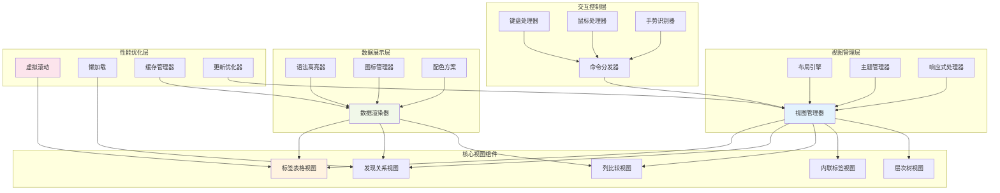
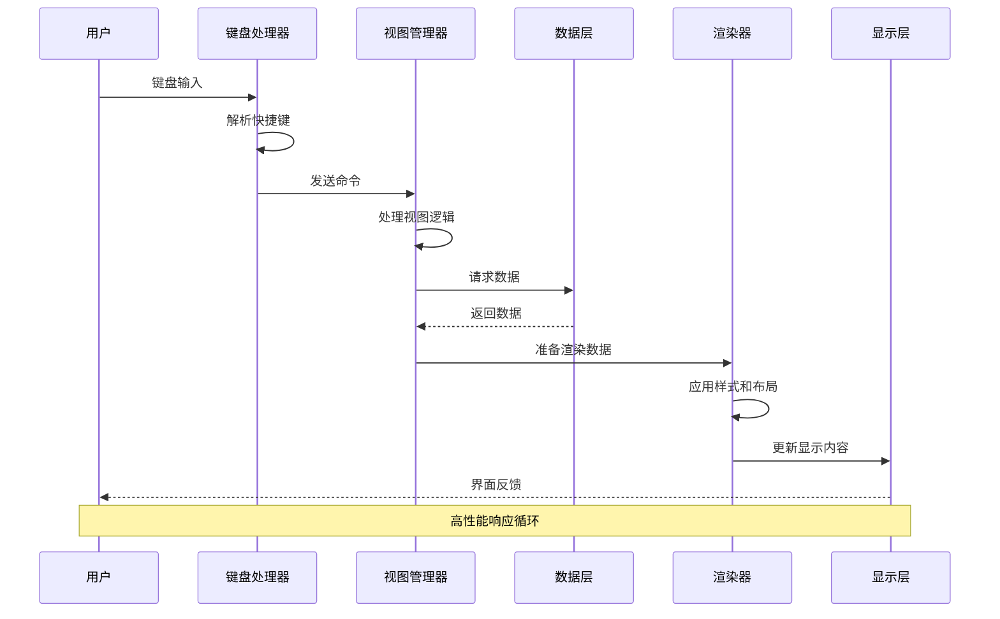
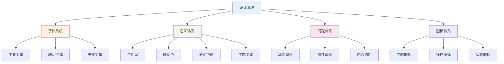
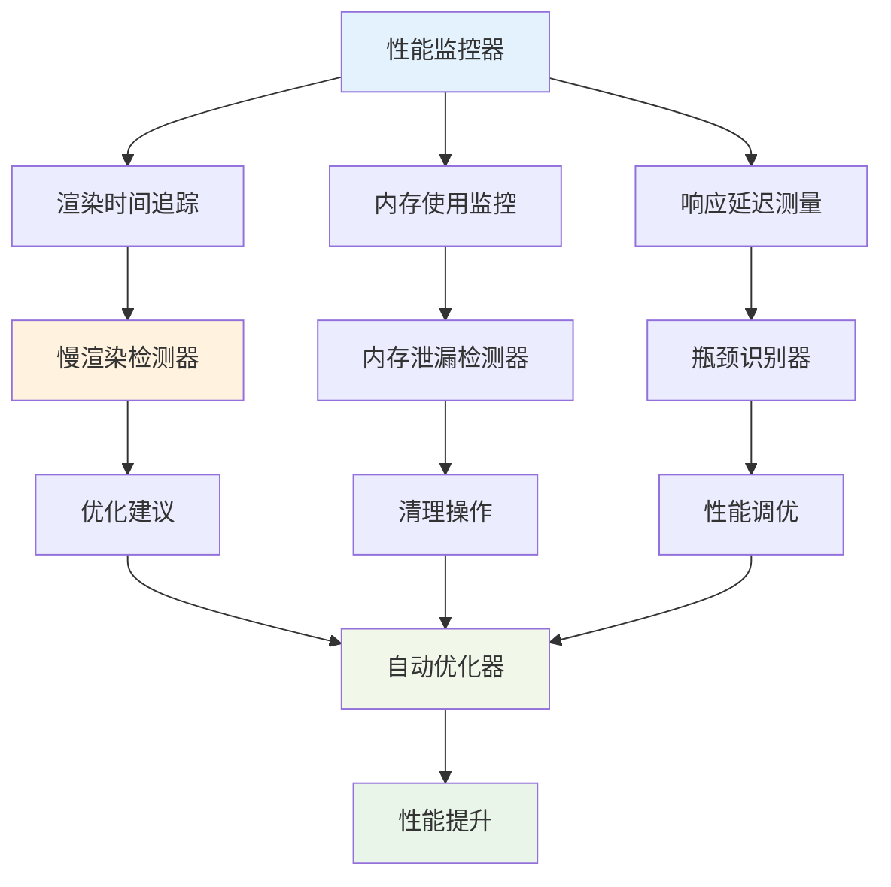

# 🎨 CREATIVE PHASE: 用户界面体验优化设计

> **创意阶段类型**: UI/UX设计  
> **创建时间**: CREATIVE模式  
> **优先级**: 4

## 🎯 问题陈述

设计**现代化标签管理界面**，解决以下关键挑战：

1. 在Emacs环境中提供现代化的用户体验
2. 设计直观的标签管理和可视化界面
3. 保持与Org-mode原生体验的一致性
4. 处理大量数据的性能和响应问题

## 🔍 界面设计选项分析

### 选项1: 基于传统Emacs Buffer的界面
**复杂度**: 低 | **实现时间**: 2-3周
- ✅ 完全原生Emacs体验，键盘操作效率高
- ❌ 视觉效果有限，复杂数据可视化困难

### 选项2: Emacs + Web技术混合界面
**复杂度**: 高 | **实现时间**: 6-8周
- ✅ 视觉效果优秀，支持复杂数据可视化
- ❌ 技术复杂度高，偏离Emacs传统

### 选项3: 增强版Emacs原生界面 ⭐**推荐**
**复杂度**: 中等 | **实现时间**: 4-5周
- ✅ 保持原生体验，性能优秀，键盘友好
- ⚠️ 视觉效果受限，需要深度Emacs知识

### 选项4: 多模态界面系统
**复杂度**: 很高 | **实现时间**: 8-10周
- ✅ 满足不同用户需求，最大化灵活性
- ❌ 开发和维护复杂，可能导致功能分散

## ✅ 界面设计决策

**选择方案**: **选项3 - 增强版Emacs原生界面**

**决策理由**:
1. **体验一致性**: 保持与Org-mode和Emacs的原生体验一致
2. **性能优秀**: 原生界面响应速度快，适合大数据量处理
3. **用户接受度**: 符合Emacs用户的使用习惯和期望
4. **技术可控**: 复杂度适中，在项目时间范围内可实现
5. **可扩展性**: 为未来界面增强留有空间

## 🏗️ 详细界面架构设计

### 核心界面组件架构



### 界面交互流程



## 🎨 现代化设计理念

### 视觉设计系统



### 智能布局算法

```emacs-lisp
;; 智能布局管理器
(defun org-supertag-ui-adaptive-layout (content-type window-size data-count)
  "根据内容类型、窗口大小和数据量自适应布局"
  (let ((layout-config nil))
    
    (pcase content-type
      ('tag-table
       ;; 标签表格布局
       (setq layout-config
             (org-supertag-ui-calculate-table-layout window-size data-count)))
      
      ('discovery-graph
       ;; 发现图布局
       (setq layout-config
             (org-supertag-ui-calculate-graph-layout window-size data-count)))
      
      ('column-comparison
       ;; 列比较布局
       (setq layout-config
             (org-supertag-ui-calculate-column-layout window-size data-count))))
    
    ;; 应用布局配置
    (org-supertag-ui-apply-layout layout-config)))

;; 响应式设计实现
(defun org-supertag-ui-responsive-design (viewport-width)
  "基于视口宽度的响应式设计"
  (cond
   ((< viewport-width 80)
    ;; 窄屏模式：简化界面
    (org-supertag-ui-enable-compact-mode))
   
   ((< viewport-width 120)
    ;; 中等屏幕：标准模式
    (org-supertag-ui-enable-standard-mode))
   
   (t
    ;; 宽屏模式：详细界面
    (org-supertag-ui-enable-detailed-mode))))
```

## ⚡ 高性能界面优化

### 虚拟滚动系统

```emacs-lisp
;; 虚拟滚动实现
(defun org-supertag-ui-virtual-scroll (data-list visible-start visible-end)
  "实现虚拟滚动，只渲染可见区域的数据"
  (let ((visible-data (seq-subseq data-list visible-start visible-end))
        (buffer-height (window-height))
        (item-height 1))
    
    ;; 计算滚动位置
    (let ((scroll-top (* visible-start item-height))
          (scroll-bottom (* visible-end item-height)))
      
      ;; 渲染可见项目
      (dolist (item visible-data)
        (org-supertag-ui-render-item item))
      
      ;; 更新滚动条状态
      (org-supertag-ui-update-scrollbar scroll-top scroll-bottom))))

;; 懒加载数据系统
(defvar org-supertag-ui-data-cache (make-hash-table :test 'equal)
  "界面数据缓存")

(defun org-supertag-ui-lazy-load-data (data-key)
  "懒加载数据，避免一次性加载大量数据"
  (or (gethash data-key org-supertag-ui-data-cache)
      (let ((data (org-supertag-db-query-data data-key)))
        (puthash data-key data org-supertag-ui-data-cache)
        data)))
```

### 性能监控与优化



## ♿ 可访问性与用户体验

### 键盘优先设计

```emacs-lisp
;; 键盘导航系统
(defvar org-supertag-ui-keymap
  (let ((map (make-sparse-keymap)))
    ;; 基础导航
    (define-key map (kbd "j") 'org-supertag-ui-next-item)
    (define-key map (kbd "k") 'org-supertag-ui-previous-item)
    (define-key map (kbd "h") 'org-supertag-ui-left-column)
    (define-key map (kbd "l") 'org-supertag-ui-right-column)
    
    ;; 快速操作
    (define-key map (kbd "RET") 'org-supertag-ui-activate-item)
    (define-key map (kbd "SPC") 'org-supertag-ui-toggle-selection)
    (define-key map (kbd "TAB") 'org-supertag-ui-next-section)
    
    ;; 搜索和过滤
    (define-key map (kbd "/") 'org-supertag-ui-search)
    (define-key map (kbd "f") 'org-supertag-ui-filter)
    (define-key map (kbd "r") 'org-supertag-ui-refresh)
    
    ;; 视图切换
    (define-key map (kbd "v t") 'org-supertag-ui-table-view)
    (define-key map (kbd "v d") 'org-supertag-ui-discovery-view)
    (define-key map (kbd "v c") 'org-supertag-ui-column-view)
    
    map)
  "org-supertag UI键盘映射")

;; 智能焦点管理
(defun org-supertag-ui-smart-focus-management ()
  "智能焦点管理，确保键盘操作流畅"
  (let ((current-item (org-supertag-ui-get-current-item))
        (visible-area (org-supertag-ui-get-visible-area)))
    
    ;; 确保当前项目在可见区域内
    (unless (org-supertag-ui-item-visible-p current-item visible-area)
      (org-supertag-ui-scroll-to-item current-item))
    
    ;; 更新视觉指示器
    (org-supertag-ui-update-focus-indicator current-item)))
```

### 主题与个性化

```emacs-lisp
;; 主题系统
(defcustom org-supertag-ui-theme 'modern-light
  "org-supertag界面主题"
  :type '(choice (const modern-light)
                 (const modern-dark)
                 (const classic)
                 (const high-contrast)
                 (const custom))
  :group 'org-supertag-ui)

;; 主题配置
(defvar org-supertag-ui-themes
  '((modern-light
     :background "#ffffff"
     :foreground "#333333"
     :primary "#007acc"
     :secondary "#6b6b6b"
     :success "#28a745"
     :warning "#ffc107"
     :error "#dc3545")
    
    (modern-dark
     :background "#1e1e1e"
     :foreground "#d4d4d4"
     :primary "#0078d4"
     :secondary "#969696"
     :success "#4caf50"
     :warning "#ff9800"
     :error "#f44336"))
  "org-supertag界面主题配置")

;; 个性化配置
(defcustom org-supertag-ui-preferences
  '(:animation-enabled t
    :show-icons t
    :compact-mode nil
    :auto-refresh t
    :keyboard-shortcuts-visible t)
  "用户界面个性化设置"
  :type 'plist
  :group 'org-supertag-ui)
```

## 📋 实施计划

### Phase 1: 核心视图组件 (2周)
- 视图管理器实现
- 标签表格视图
- 发现关系视图
- 基础交互逻辑

### Phase 2: 性能优化 (1.5周)
- 虚拟滚动实现
- 懒加载机制
- 缓存系统
- 渲染优化

### Phase 3: 用户体验增强 (1.5周)
- 键盘导航系统
- 主题管理器
- 响应式布局
- 个性化配置

## 🎯 验证标准

- [ ] 支持1000+标签的流畅滚动
- [ ] 键盘操作响应时间<100ms
- [ ] 界面渲染时间<500ms
- [ ] 支持多种屏幕尺寸
- [ ] 可访问性评分>90%
- [ ] 用户满意度>4.5/5.0

---
*用户界面体验优化设计 - CREATIVE模式完成* 