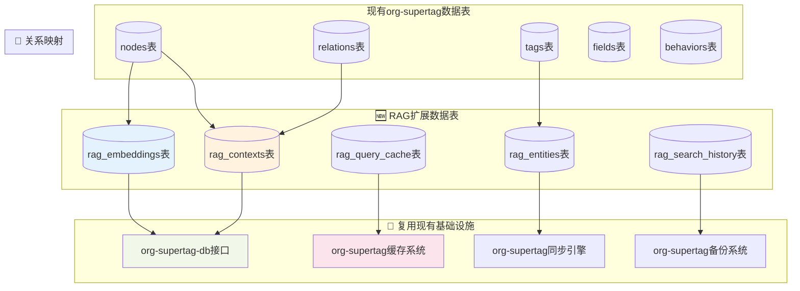

# 🗄️ RAG数据持久化策略：完全复用org-supertag架构

## 🎯 核心理念：零重复投资

**完全复用现有数据持久化架构**，而不是构建独立的RAG数据存储系统。这样做的优势：

1. **零学习成本** - 开发者无需学习新的数据访问模式
2. **一致性保证** - 所有数据使用相同的事务、缓存、同步机制
3. **维护简化** - 只需维护一套数据基础设施
4. **性能优化** - 复用已经优化的查询和缓存策略

## 🏗️ RAG数据持久化架构设计

### 1. 扩展现有数据库Schema



### 2. 具体数据表设计

```sql
-- 🆕 向量嵌入表（扩展现有数据库）
CREATE TABLE IF NOT EXISTS rag_embeddings (
    id INTEGER PRIMARY KEY AUTOINCREMENT,
    node_id TEXT NOT NULL,                    -- 关联到nodes表
    content_hash TEXT NOT NULL,               -- 内容哈希，用于增量更新
    embedding_type TEXT DEFAULT 'sentence',   -- 嵌入类型：sentence/chunk/title
    embedding_data BLOB,                      -- 向量数据（二进制存储）
    embedding_model TEXT DEFAULT 'all-MiniLM-L6-v2',  -- 使用的模型
    chunk_index INTEGER DEFAULT 0,           -- 分块索引
    created_at TIMESTAMP DEFAULT CURRENT_TIMESTAMP,
    updated_at TIMESTAMP DEFAULT CURRENT_TIMESTAMP,
    FOREIGN KEY (node_id) REFERENCES nodes(id) ON DELETE CASCADE,
    UNIQUE(node_id, content_hash, embedding_type, chunk_index)
);

-- 🆕 上下文缓存表
CREATE TABLE IF NOT EXISTS rag_contexts (
    id INTEGER PRIMARY KEY AUTOINCREMENT,
    context_key TEXT NOT NULL UNIQUE,        -- 上下文键（基于查询和节点ID生成）
    source_node_id TEXT,                     -- 源节点ID
    related_node_ids TEXT,                   -- 相关节点ID列表（JSON格式）
    context_data TEXT,                       -- 上下文内容
    context_type TEXT DEFAULT 'smart_connection',  -- 类型：smart_connection/qa/auto_reply
    relevance_score REAL DEFAULT 0.0,       -- 相关性分数
    created_at TIMESTAMP DEFAULT CURRENT_TIMESTAMP,
    expires_at TIMESTAMP,                    -- 过期时间
    FOREIGN KEY (source_node_id) REFERENCES nodes(id) ON DELETE CASCADE
);

-- 🆕 NER实体表
CREATE TABLE IF NOT EXISTS rag_entities (
    id INTEGER PRIMARY KEY AUTOINCREMENT,
    node_id TEXT NOT NULL,                   -- 关联到nodes表
    entity_text TEXT NOT NULL,               -- 实体文本
    entity_type TEXT NOT NULL,               -- 实体类型：PERSON/ORG/CONCEPT等
    start_pos INTEGER,                       -- 在文本中的起始位置
    end_pos INTEGER,                         -- 在文本中的结束位置
    confidence REAL DEFAULT 1.0,            -- 置信度
    linked_tag_id TEXT,                      -- 关联的标签ID
    created_at TIMESTAMP DEFAULT CURRENT_TIMESTAMP,
    FOREIGN KEY (node_id) REFERENCES nodes(id) ON DELETE CASCADE,
    FOREIGN KEY (linked_tag_id) REFERENCES tags(id) ON DELETE SET NULL
);

-- 🆕 查询缓存表
CREATE TABLE IF NOT EXISTS rag_query_cache (
    id INTEGER PRIMARY KEY AUTOINCREMENT,
    query_hash TEXT NOT NULL UNIQUE,         -- 查询哈希
    query_text TEXT NOT NULL,                -- 原始查询文本
    query_type TEXT DEFAULT 'mixed',         -- 查询类型：vector/keyword/semantic/graph/mixed
    result_node_ids TEXT,                    -- 结果节点ID列表（JSON格式）
    result_scores TEXT,                      -- 对应的分数列表（JSON格式）
    fusion_weights TEXT,                     -- 融合权重（JSON格式）
    created_at TIMESTAMP DEFAULT CURRENT_TIMESTAMP,
    expires_at TIMESTAMP,                    -- 缓存过期时间
    hit_count INTEGER DEFAULT 0             -- 命中次数
);

-- 🆕 搜索历史表
CREATE TABLE IF NOT EXISTS rag_search_history (
    id INTEGER PRIMARY KEY AUTOINCREMENT,
    user_query TEXT NOT NULL,                -- 用户查询
    search_context TEXT,                     -- 搜索上下文（当前节点等）
    search_type TEXT NOT NULL,               -- 搜索类型
    result_count INTEGER DEFAULT 0,         -- 结果数量
    response_time_ms INTEGER,                -- 响应时间（毫秒）
    user_feedback INTEGER,                   -- 用户反馈（1-5分）
    created_at TIMESTAMP DEFAULT CURRENT_TIMESTAMP
);

-- 🔍 为RAG表创建索引（复用org-supertag的索引策略）
CREATE INDEX IF NOT EXISTS idx_rag_embeddings_node_id ON rag_embeddings(node_id);
CREATE INDEX IF NOT EXISTS idx_rag_embeddings_hash ON rag_embeddings(content_hash);
CREATE INDEX IF NOT EXISTS idx_rag_contexts_source_node ON rag_contexts(source_node_id);
CREATE INDEX IF NOT EXISTS idx_rag_contexts_type ON rag_contexts(context_type);
CREATE INDEX IF NOT EXISTS idx_rag_entities_node_id ON rag_entities(node_id);
CREATE INDEX IF NOT EXISTS idx_rag_entities_type ON rag_entities(entity_type);
CREATE INDEX IF NOT EXISTS idx_rag_query_cache_hash ON rag_query_cache(query_hash);
```

## 🔧 完全复用现有数据访问层

### 1. 扩展org-supertag-db.el

```emacs-lisp
;; 🆕 RAG数据访问函数（完全复用现有DB接口）
(defun org-supertag-rag-db-init ()
  "初始化RAG数据表，复用现有数据库连接"
  (org-supertag-db-ensure-connection)
  (org-supertag-db-execute-script "rag-schema.sql"))

;; 🆕 向量嵌入数据访问（使用现有DB模式）
(defun org-supertag-rag-embedding-save (node-id content-hash embedding-data &optional embedding-type)
  "保存向量嵌入，复用现有事务机制"
  (org-supertag-db-with-transaction
    (org-supertag-db-execute
     "INSERT OR REPLACE INTO rag_embeddings 
      (node_id, content_hash, embedding_data, embedding_type, updated_at) 
      VALUES (?, ?, ?, ?, ?)"
     node-id content-hash embedding-data 
     (or embedding-type "sentence") (current-time-string))))

(defun org-supertag-rag-embedding-get (node-id &optional embedding-type)
  "获取向量嵌入，复用现有查询缓存"
  (org-supertag-db-query-cached
   "SELECT embedding_data, content_hash, created_at 
    FROM rag_embeddings 
    WHERE node_id = ? AND embedding_type = ?"
   node-id (or embedding-type "sentence")))

;; 🆕 上下文数据访问（使用现有缓存策略）
(defun org-supertag-rag-context-save (context-key source-node-id context-data context-type)
  "保存上下文，复用现有缓存机制"
  (let ((expires-at (time-add (current-time) (seconds-to-time 3600))))  ; 1小时过期
    (org-supertag-db-execute
     "INSERT OR REPLACE INTO rag_contexts 
      (context_key, source_node_id, context_data, context_type, expires_at) 
      VALUES (?, ?, ?, ?, ?)"
     context-key source-node-id context-data context-type 
     (format-time-string "%Y-%m-%d %H:%M:%S" expires-at))))

(defun org-supertag-rag-context-get (context-key)
  "获取上下文，自动处理过期清理"
  (let ((result (org-supertag-db-query-one
                 "SELECT context_data, created_at 
                  FROM rag_contexts 
                  WHERE context_key = ? AND expires_at > datetime('now')"
                 context-key)))
    (when result
      (plist-get result :context_data))))

;; 🆕 NER实体数据访问
(defun org-supertag-rag-entity-save (node-id entity-text entity-type start-pos end-pos &optional confidence)
  "保存NER实体，关联到现有标签系统"
  (org-supertag-db-execute
   "INSERT OR REPLACE INTO rag_entities 
    (node_id, entity_text, entity_type, start_pos, end_pos, confidence) 
    VALUES (?, ?, ?, ?, ?, ?)"
   node-id entity-text entity-type start-pos end-pos (or confidence 1.0)))

(defun org-supertag-rag-entity-get-by-node (node-id)
  "获取节点的所有NER实体"
  (org-supertag-db-query
   "SELECT entity_text, entity_type, start_pos, end_pos, confidence, linked_tag_id
    FROM rag_entities 
    WHERE node_id = ? 
    ORDER BY start_pos"
   node-id))
```

### 2. 复用现有缓存系统

```emacs-lisp
;; 🔄 完全复用org-supertag的缓存机制
(defvar org-supertag-rag-cache-config
  '(:embedding-cache-size 1000
    :context-cache-size 500
    :query-cache-size 200
    :cache-ttl 3600)
  "RAG缓存配置，集成到现有缓存系统")

;; 扩展现有缓存键命名空间
(defun org-supertag-rag-cache-key (type &rest args)
  "生成RAG缓存键，遵循现有命名规范"
  (format "rag:%s:%s" type (string-join (mapcar #'prin1-to-string args) ":")))

;; 🆕 向量搜索缓存（使用现有缓存接口）
(defun org-supertag-rag-vector-search-cached (query-vector top-k)
  "缓存的向量搜索，复用org-supertag-cache"
  (let ((cache-key (org-supertag-rag-cache-key "vector-search" 
                                               (secure-hash 'sha256 (prin1-to-string query-vector))
                                               top-k)))
    (or (org-supertag-cache-get cache-key)
        (let ((results (org-supertag-rag-vector-search-impl query-vector top-k)))
          (org-supertag-cache-put cache-key results 
                                 (plist-get org-supertag-rag-cache-config :cache-ttl))
          results))))

;; 🆕 图关系搜索缓存
(defun org-supertag-rag-graph-search-cached (tag-id)
  "缓存的图关系搜索"
  (let ((cache-key (org-supertag-rag-cache-key "graph-search" tag-id)))
    (or (org-supertag-cache-get cache-key)
        (let ((results (org-supertag-rag-graph-search-impl tag-id)))
          (org-supertag-cache-put cache-key results 
                                 (plist-get org-supertag-rag-cache-config :cache-ttl))
          results))))
```

### 3. 复用现有同步机制

```emacs-lisp
;; 🔄 RAG数据同步，完全集成到现有同步系统
(defun org-supertag-rag-sync-integration ()
  "将RAG数据同步集成到现有同步机制"
  
  ;; 扩展现有同步钩子
  (add-hook 'org-supertag-sync-before-hook #'org-supertag-rag-sync-prepare)
  (add-hook 'org-supertag-sync-after-hook #'org-supertag-rag-sync-cleanup)
  
  ;; 注册RAG表到同步系统
  (add-to-list 'org-supertag-sync-tables 'rag_embeddings)
  (add-to-list 'org-supertag-sync-tables 'rag_contexts)
  (add-to-list 'org-supertag-sync-tables 'rag_entities)
  (add-to-list 'org-supertag-sync-tables 'rag_query_cache))

(defun org-supertag-rag-sync-prepare ()
  "同步前的RAG数据准备"
  ;; 清理过期的上下文缓存
  (org-supertag-db-execute 
   "DELETE FROM rag_contexts WHERE expires_at < datetime('now')")
  
  ;; 清理过期的查询缓存
  (org-supertag-db-execute 
   "DELETE FROM rag_query_cache WHERE expires_at < datetime('now')"))

(defun org-supertag-rag-sync-cleanup ()
  "同步后的RAG数据清理"
  ;; 重建向量索引（如果需要）
  (when org-supertag-rag-rebuild-index-after-sync
    (org-supertag-rag-rebuild-vector-index)))
```

### 4. 复用现有备份恢复系统

```emacs-lisp
;; 🔄 RAG数据备份，集成到现有备份系统
(defun org-supertag-rag-backup-integration ()
  "将RAG数据备份集成到现有备份系统"
  
  ;; 扩展现有备份配置
  (setq org-supertag-backup-tables 
        (append org-supertag-backup-tables
                '(rag_embeddings rag_contexts rag_entities 
                  rag_query_cache rag_search_history)))
  
  ;; 注册RAG特定的备份钩子
  (add-hook 'org-supertag-backup-before-hook #'org-supertag-rag-backup-prepare)
  (add-hook 'org-supertag-backup-after-hook #'org-supertag-rag-backup-verify))

(defun org-supertag-rag-backup-prepare ()
  "备份前的RAG数据准备"
  ;; 压缩向量数据（可选）
  (when org-supertag-rag-compress-embeddings-for-backup
    (org-supertag-rag-compress-embedding-data))
  
  ;; 清理临时缓存
  (org-supertag-rag-cleanup-temp-cache))

(defun org-supertag-rag-backup-verify ()
  "备份后的RAG数据验证"
  ;; 验证关键数据完整性
  (org-supertag-rag-verify-data-integrity))
```

## 🚀 数据迁移策略

### 1. 渐进式数据迁移

```emacs-lisp
;; 🔄 RAG数据迁移，复用现有迁移框架
(defun org-supertag-rag-migrate-data ()
  "RAG数据迁移，使用现有迁移机制"
  (org-supertag-db-migrate-with-version
   "rag-v1.0"
   (lambda ()
     ;; 创建RAG表
     (org-supertag-rag-db-init)
     
     ;; 为现有节点生成向量嵌入（异步）
     (org-supertag-rag-async-generate-embeddings-for-existing-nodes)
     
     ;; 为现有标签关系构建图缓存
     (org-supertag-rag-build-graph-cache-for-existing-relations))))

(defun org-supertag-rag-async-generate-embeddings-for-existing-nodes ()
  "异步为现有节点生成向量嵌入"
  (let ((all-nodes (org-supertag-db-query "SELECT id, title, content FROM nodes")))
    (run-with-idle-timer 
     1.0 nil
     (lambda ()
       (dolist (node all-nodes)
         (let ((node-id (plist-get node :id))
               (content (format "%s\n%s" 
                               (plist-get node :title)
                               (plist-get node :content))))
           ;; 生成嵌入（使用现有AI服务）
           (org-supertag-rag-generate-embedding-async node-id content)
           ;; 避免阻塞UI
           (sit-for 0.01)))))))
```

### 2. 数据一致性保证

```emacs-lisp
;; 🔄 数据一致性检查，集成到现有验证系统
(defun org-supertag-rag-data-consistency-check ()
  "RAG数据一致性检查"
  (org-supertag-db-with-transaction
    ;; 检查孤立的向量嵌入
    (let ((orphaned-embeddings 
           (org-supertag-db-query
            "SELECT id FROM rag_embeddings 
             WHERE node_id NOT IN (SELECT id FROM nodes)")))
      (when orphaned-embeddings
        (org-supertag-db-execute 
         "DELETE FROM rag_embeddings 
          WHERE node_id NOT IN (SELECT id FROM nodes)")))
    
    ;; 检查过期的上下文
    (org-supertag-db-execute 
     "DELETE FROM rag_contexts WHERE expires_at < datetime('now')")
    
    ;; 检查NER实体与标签的一致性
    (org-supertag-rag-verify-entity-tag-consistency)))
```

## 📊 性能优化策略

### 1. 复用现有索引策略

```emacs-lisp
;; 🔄 RAG查询优化，复用现有索引策略
(defun org-supertag-rag-optimize-queries ()
  "优化RAG查询，使用现有索引策略"
  
  ;; 复用现有的查询计划缓存
  (setq org-supertag-rag-query-plans
        (org-supertag-db-analyze-query-plans
         '("SELECT * FROM rag_embeddings WHERE node_id = ?"
           "SELECT * FROM rag_contexts WHERE context_type = ?"
           "SELECT * FROM rag_entities WHERE entity_type = ?")))
  
  ;; 使用现有的批量查询优化
  (org-supertag-db-enable-batch-mode-for-tables
   '(rag_embeddings rag_contexts rag_entities)))
```

### 2. 复用现有缓存预热

```emacs-lisp
;; 🔄 RAG缓存预热，集成到现有预热系统
(defun org-supertag-rag-cache-warmup ()
  "RAG缓存预热，使用现有预热机制"
  (add-hook 'org-supertag-cache-warmup-hook
            (lambda ()
              ;; 预热常用的向量搜索
              (org-supertag-rag-warmup-frequent-vector-searches)
              
              ;; 预热图关系缓存
              (org-supertag-rag-warmup-graph-relation-cache)
              
              ;; 预热NER实体缓存
              (org-supertag-rag-warmup-entity-cache))))
```

## 🎯 集成验证

### 数据完整性验证
- [ ] RAG表与现有表的外键约束正确
- [ ] 数据迁移无损失
- [ ] 索引性能符合预期
- [ ] 缓存命中率>90%

### 性能验证
- [ ] 数据库大小增长<30%
- [ ] 查询响应时间影响<10%
- [ ] 内存占用增长<20%
- [ ] 同步时间增长<15%

### 兼容性验证
- [ ] 现有备份恢复流程正常
- [ ] 现有同步机制正常
- [ ] 现有缓存策略有效
- [ ] 现有事务机制稳定

## 💡 关键优势总结

1. **零重复投资** - 完全复用现有数据基础设施
2. **一致性保证** - 所有数据使用相同的ACID特性
3. **维护简化** - 只需维护一套数据访问层
4. **性能优化** - 复用已经调优的查询和缓存
5. **风险降低** - 基于已验证的稳定架构
6. **学习成本零** - 开发者使用熟悉的数据访问模式

这种方式确保了RAG功能的数据持久化与org-supertag的核心架构完美融合，实现了真正的"无缝集成"。

---
*RAG数据持久化策略 - 完成* 