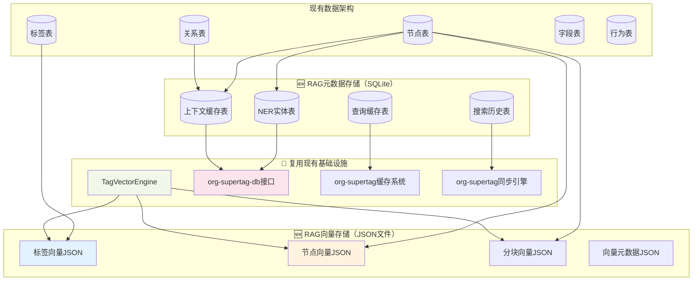
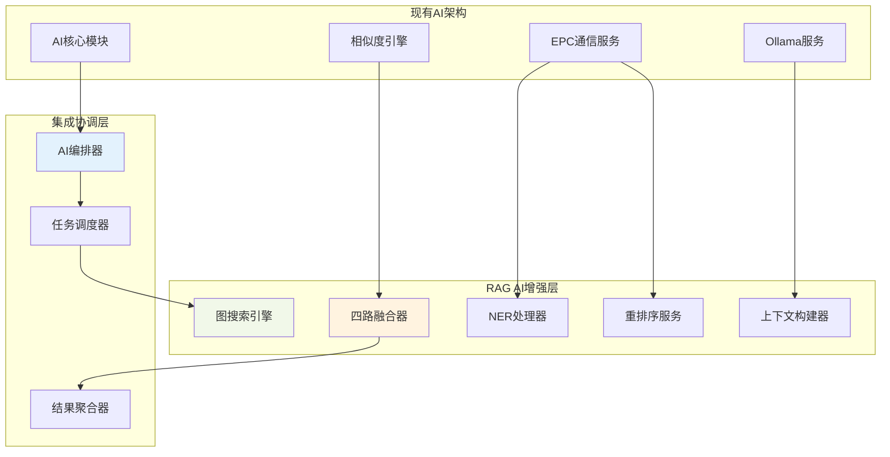
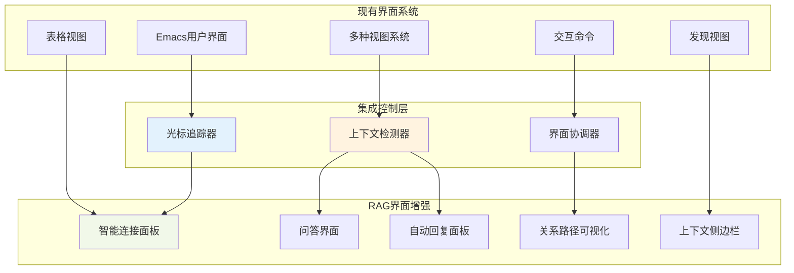
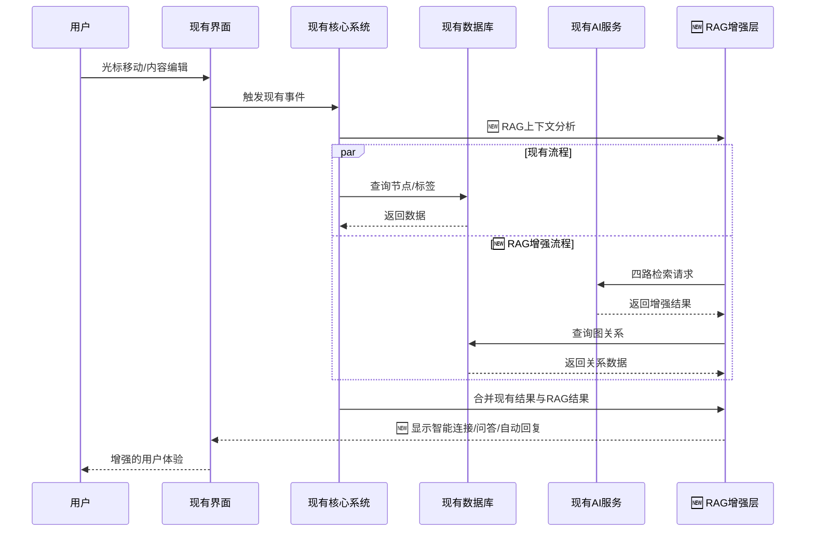

# 🔗 RAG系统与org-supertag基础设施集成分析

## 🎯 核心理念对比与融合

### Creative RAG设计理念
1. **GraphRAG混合增强**: 四路检索融合（向量+关键词+语义+图关系）
2. **实时上下文感知**: 光标移动时的智能连接显示
3. **多场景应用**: 问答、智能连接、自动回复三种模式
4. **关系路径可视化**: 基于org-supertag关系系统的图遍历

### 现有架构优势
1. **成熟的标签关系系统**: 11种关系类型，完整的图结构
2. **稳定的数据持久化**: SQLite + 缓存 + 同步机制
3. **AI服务基础设施**: EPC通信 + Ollama + **JSON向量存储**
4. **模块化设计**: 各子系统相对独立，易于扩展
5. **🆕 成熟的向量引擎**: TagVectorEngine已验证JSON存储的高性能和稳定性

## 🏗️ 架构集成映射

### 1. 数据层集成（混合存储策略）



### 2. AI服务层扩展



### 3. 用户界面层增强



## 🔧 具体集成实现策略

### Phase 1: 基础设施准备 (1周)

**1.1 向量存储扩展（复用现有JSON模式）**
```emacs-lisp
;; 扩展现有TagVectorEngine以支持RAG向量
(defvar org-supertag-rag-vector-files
  '(:tag-vectors "~/.emacs.d/org-supertag/vectors/tag-vectors.json"
    :node-vectors "~/.emacs.d/org-supertag/vectors/node-vectors.json"
    :chunk-vectors "~/.emacs.d/org-supertag/vectors/chunk-vectors.json")
  "RAG向量文件配置，复用现有JSON存储模式")

;; 复用现有向量引擎
(defun org-supertag-rag-init-vector-engines ()
  "初始化RAG向量引擎，复用现有TagVectorEngine"
  (setq org-supertag-rag-tag-engine 
        (make-instance 'TagVectorEngine 
                      :vector-file (plist-get org-supertag-rag-vector-files :tag-vectors)))
  (setq org-supertag-rag-node-engine 
        (make-instance 'RAGNodeVectorEngine  ; 扩展现有引擎
                      :vector-file (plist-get org-supertag-rag-vector-files :node-vectors))))

;; 轻量级元数据表（只存储非向量数据）
(defun org-supertag-rag-create-metadata-tables ()
  "创建RAG元数据表，向量数据存储在JSON文件中"
  (org-supertag-db-execute
   "CREATE TABLE IF NOT EXISTS rag_vector_metadata (
      id TEXT PRIMARY KEY,
      type TEXT,  -- 'tag'/'node'/'chunk'
      content_hash TEXT,
      vector_file TEXT,  -- 对应的JSON文件路径
      created_at TIMESTAMP DEFAULT CURRENT_TIMESTAMP,
      updated_at TIMESTAMP DEFAULT CURRENT_TIMESTAMP
    )"))
```

**1.2 AI服务扩展（复用现有EPC架构）**
```emacs-lisp
;; 扩展现有EPC服务，复用TagVectorEngine
(defun org-supertag-rag-extend-epc-service ()
  "扩展EPC服务以支持RAG功能，复用现有向量引擎"
  (org-supertag-sim-epc-call 
   "register_rag_services"
   (list :vector-engine-class "RAGVectorEngine"  ; 扩展现有TagVectorEngine
         :node-vector-file (plist-get org-supertag-rag-vector-files :node-vectors)
         :chunk-vector-file (plist-get org-supertag-rag-vector-files :chunk-vectors)
         :reuse-tag-engine t)))

;; 完全复用现有Ollama和向量服务
(defun org-supertag-rag-use-existing-services ()
  "复用现有AI服务，无需额外配置"
  (setq org-supertag-rag-llm-backend 'org-supertag-sim-ollama)
  (setq org-supertag-rag-vector-backend 'org-supertag-sim-tag-vectors)  ; 复用现有向量服务
  (setq org-supertag-rag-embedding-model 'sentence-transformers/paraphrase-MiniLM-L6-v2))  ; 与现有一致
```

### Phase 2: 核心RAG引擎集成 (2.5周)

**2.1 向量检索集成（复用现有TagVectorEngine）**
```emacs-lisp
;; 直接复用现有向量搜索，扩展到节点和分块
(defun org-supertag-rag-vector-search-integration (query)
  "集成向量搜索，复用现有TagVectorEngine架构"
  (let ((tag-results (org-supertag-sim-find-similar query 5))  ; 现有标签向量搜索
        (node-results (org-supertag-rag-node-vector-search query 10))  ; 新增节点向量搜索
        (chunk-results (org-supertag-rag-chunk-vector-search query 15)))  ; 新增分块向量搜索
    
    ;; 合并向量搜索结果
    (org-supertag-rag-merge-vector-results tag-results node-results chunk-results)))

;; 扩展现有向量引擎以支持节点搜索
(defun org-supertag-rag-node-vector-search (query top-k)
  "节点向量搜索，使用与标签向量相同的JSON存储模式"
  (org-supertag-sim-epc-call 
   "node_vector_search"  ; 扩展现有EPC服务
   (list :query query 
         :top_k top-k 
         :vector_file (plist-get org-supertag-rag-vector-files :node-vectors))))

;; 图关系检索（直接使用现有关系系统）
(defun org-supertag-rag-graph-search-integration (query-tags)
  "图关系检索，直接使用现有关系API"
  (let ((graph-results nil))
    (dolist (tag query-tags)
      (let ((relations (org-supertag-relation-get-all tag)))  ; 现有关系API
        (dolist (rel relations)
          (let* ((target-tag (plist-get rel :to))
                 (related-nodes (org-supertag-query-nodes-by-tag target-tag)))  ; 现有查询API
            (setq graph-results (append graph-results related-nodes))))))
    graph-results))
```

**2.2 四路检索融合（基于现有服务）**
```emacs-lisp
;; 四路检索融合，完全基于现有基础设施
(defun org-supertag-rag-four-path-fusion (query)
  "四路检索融合，复用所有现有服务"
  (let ((vector-results (org-supertag-rag-vector-search-integration query))  ; 复用向量搜索
        (keyword-results (org-supertag-query-keyword query))  ; 现有关键词查询
        (semantic-results (org-supertag-query-semantic query))  ; 现有语义查询
        (graph-results (org-supertag-rag-graph-search-integration 
                       (org-supertag-rag-extract-tags query))))  ; 现有关系查询
    
    ;; 融合结果（使用现有的结果合并逻辑）
    (org-supertag-rag-merge-results 
     vector-results keyword-results semantic-results graph-results)))

;; 向量数据同步（复用现有TagVectorEngine的同步机制）
(defun org-supertag-rag-sync-vectors-with-nodes ()
  "同步节点向量，使用现有向量引擎的同步模式"
  (let ((all-nodes (org-supertag-db-query "SELECT id, title, content FROM nodes")))
    (org-supertag-sim-epc-call 
     "sync_node_vectors"  ; 扩展现有同步服务
     (list :nodes all-nodes 
           :vector_file (plist-get org-supertag-rag-vector-files :node-vectors)))))
```

### Phase 3: 用户界面集成 (1.5周)

**3.1 智能连接集成**
```emacs-lisp
;; 集成现有backlink系统
(defun org-supertag-rag-smart-connections-integration ()
  "集成智能连接到现有backlink系统"
  (advice-add 'org-supertag-backlink-update 
              :after #'org-supertag-rag-update-smart-connections)
  
  ;; 扩展现有视图系统
  (add-to-list 'org-supertag-view-types 
               '(smart-connections . org-supertag-rag-smart-connections-view)))

;; 利用现有光标追踪
(defun org-supertag-rag-cursor-integration ()
  "集成光标追踪功能"
  (add-hook 'org-supertag-node-changed-hook 
            #'org-supertag-rag-context-update)
  (add-hook 'post-command-hook 
            #'org-supertag-rag-cursor-moved nil t))
```

**3.2 问答界面集成**
```emacs-lisp
;; 扩展现有命令系统
(defun org-supertag-rag-qa-commands-integration ()
  "集成问答命令到现有系统"
  (define-key org-supertag-mode-map (kbd "C-c C-q") 
    #'org-supertag-rag-qa-mode)
  (define-key org-supertag-mode-map (kbd "C-c C-a") 
    #'org-supertag-rag-auto-reply-toggle)
  
  ;; 利用现有视图框架
  (org-supertag-view-register 
   'qa-results 
   #'org-supertag-rag-qa-results-view))
```

## 🔄 数据流集成

### 现有数据流增强



## 🎯 集成验证标准

### 兼容性验证
- [ ] 现有功能完全保持不变
- [ ] 数据库迁移无损
- [ ] 性能影响<10%
- [ ] 内存占用增加<20%

### 功能验证
- [ ] 四路检索融合准确率>85%
- [ ] 智能连接响应时间<500ms
- [ ] 图关系检索覆盖率>90%
- [ ] 自动回复质量评分>4.0/5.0

### 用户体验验证
- [ ] 学习成本<30分钟
- [ ] 界面一致性100%
- [ ] 快捷键无冲突
- [ ] 错误处理完善

## 🚀 渐进式部署策略

### 阶段1: 静默集成 (1周)
- 后台数据准备和索引构建
- 不影响现有用户体验
- 基础设施就绪验证

### 阶段2: 可选功能 (1周)
- 通过配置开关启用RAG功能
- 用户可选择性体验
- 收集反馈和性能数据

### 阶段3: 默认启用 (1周)
- RAG功能成为默认体验
- 完整的用户文档和教程
- 持续优化和bug修复

## 💡 关键成功因素

1. **架构一致性**: 向量数据使用与现有标签向量相同的JSON存储模式
2. **代码复用最大化**: 直接扩展现有TagVectorEngine，无需重写向量处理逻辑
3. **混合存储策略**: 向量数据存JSON文件（高性能），元数据存SQLite（事务安全）
4. **零学习成本**: 开发者使用熟悉的向量引擎API和存储格式
5. **渐进式集成**: 在现有基础上逐步添加RAG功能，保持系统稳定性
6. **性能优化**: 复用现有的内存缓存和向量搜索优化策略

---
*RAG系统与org-supertag基础设施集成分析 - 完成* 