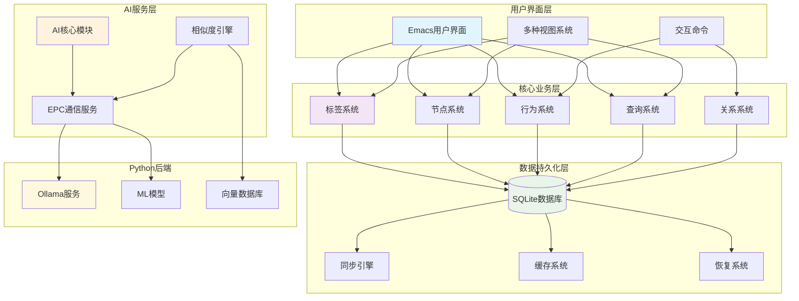
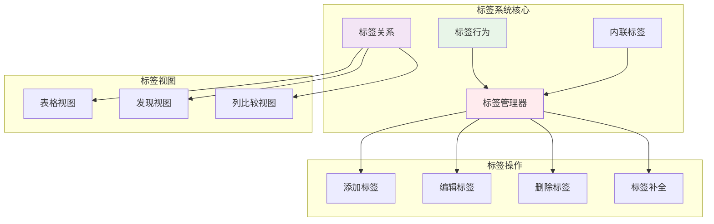
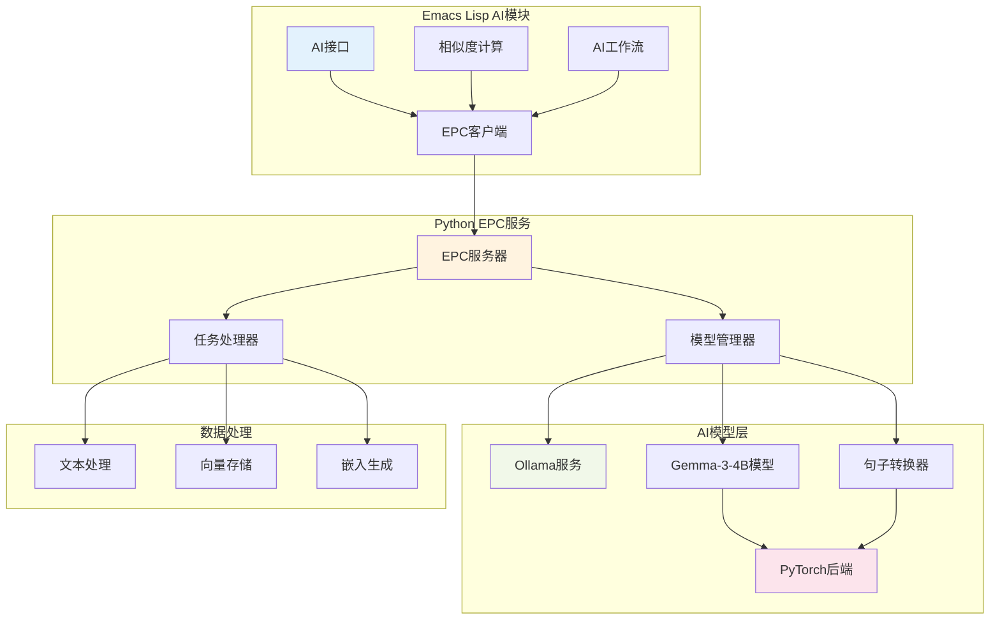
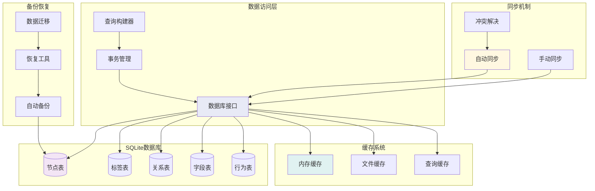
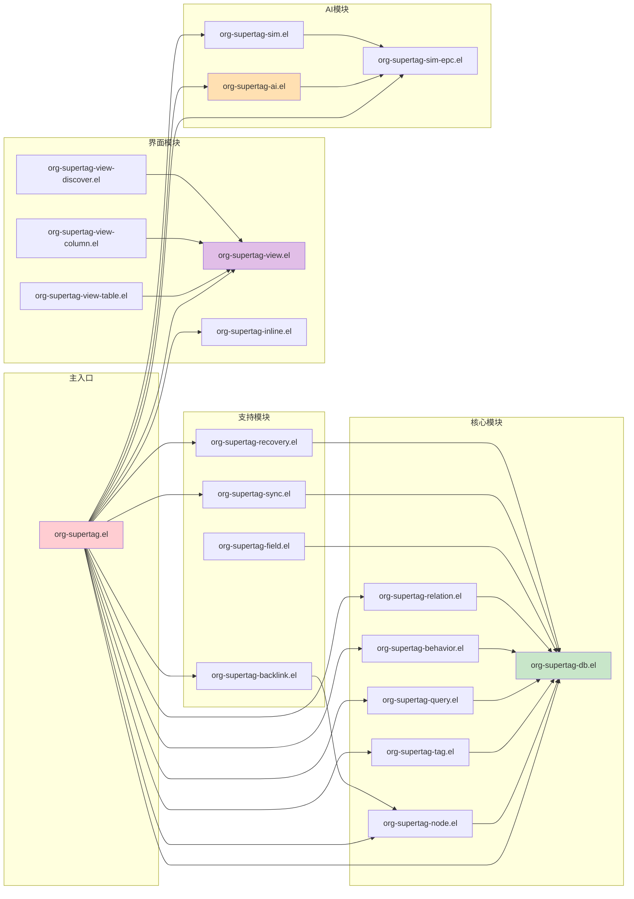
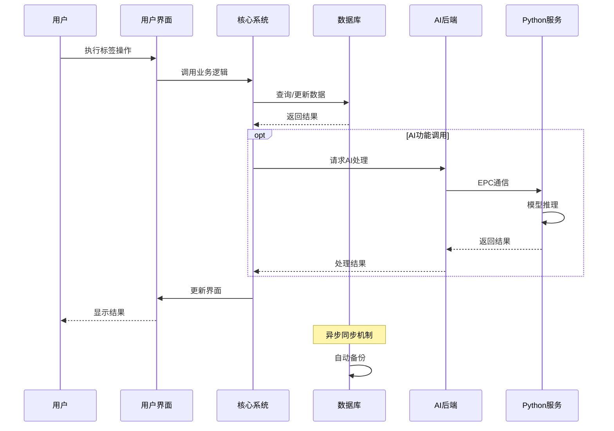

# org-supertag 系统架构文档

## 🏗️ 整体系统架构

## 🧩 核心子系统详细架构

### 1. 标签系统架构

### 2. AI后端系统架构

### 3. 数据持久化架构

## 📊 模块依赖关系图

## 🔄 数据流架构

## 🛠️ 技术栈映射

| 层级 | 技术栈 | 主要组件 |
|------|--------|----------|
| **用户界面** | Emacs Lisp | org-mode, 自定义界面 |
| **业务逻辑** | Emacs Lisp | 核心模块、行为系统 |
| **AI服务** | Python + Emacs Lisp | EPC通信、模型推理 |
| **数据存储** | SQLite + 文件系统 | 数据库、缓存、备份 |
| **AI模型** | PyTorch生态 | Ollama、Transformers |
| **通信协议** | EPC (Emacs-Python) | 异步消息传递 |

## 📈 性能和扩展性考虑

### 性能优化点
- **缓存策略**: 多层缓存减少数据库访问
- **异步处理**: AI推理和数据同步异步化
- **索引优化**: 数据库查询性能优化
- **增量同步**: 只同步变更部分

### 扩展性设计
- **模块化架构**: 各模块相对独立
- **插件机制**: 行为系统支持自定义扩展
- **配置驱动**: 多数功能可通过配置调整
- **版本兼容**: 数据迁移和向后兼容

---
*架构文档 - PLAN模式生成* 