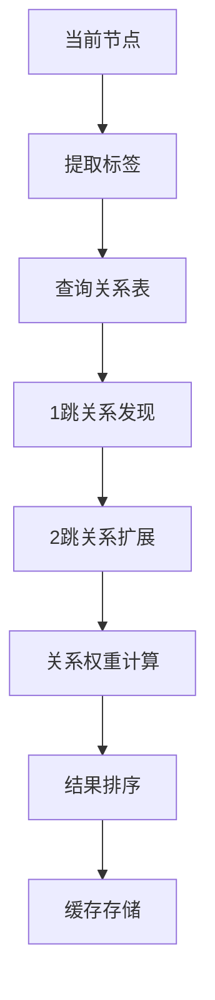
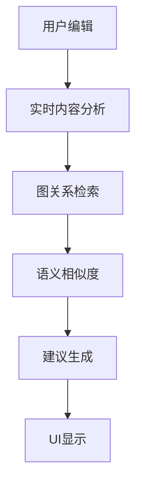

# org-supertag GraphRAG 实施方案

## 🎯 目标：让org-supertag成为"活着的"知识管理工具

基于org-supertag现有的SQLite数据层和关系系统，实现轻量级GraphRAG功能：

### 核心功能
1. **智能backlink增强** - 在backlink面板显示相关知识节点
2. **笔记建议系统** - 制作笔记时提供智能建议  
3. **知识间隙发现** - 识别潜在的知识空白，促进跨主题研究
4. **自动内容生成** - 根据tag要求自动生成对应内容

## 🏗️ 技术架构：三层渐进式实现

### Phase 1: 基础图检索层 (1-2周)
```
现有SQLite数据 → 图关系检索 → 增强backlink面板
```

**核心组件**：
- `org-supertag-graphrag-search.el` - 图关系搜索引擎
- `org-supertag-graphrag-backlink.el` - 增强backlink集成
- `org-supertag-graphrag-cache.el` - 图检索缓存系统

### Phase 2: 语义增强层 (2-3周)  
```
图检索结果 → 向量相似度 → 语义排序 → 智能建议
```

**核心组件**：
- `org-supertag-graphrag-embedding.el` - 轻量级向量化
- `org-supertag-graphrag-similarity.el` - 语义相似度计算
- `org-supertag-graphrag-suggest.el` - 笔记建议引擎

### Phase 3: 智能生成层 (1-2周)
```
上下文构建 → LLM调用 → 内容生成 → 知识间隙分析
```

**核心组件**：
- `org-supertag-graphrag-context.el` - 上下文构建器
- `org-supertag-graphrag-generate.el` - 内容生成引擎
- `org-supertag-graphrag-gap.el` - 知识间隙分析

## 📊 数据流设计

### 1. 图关系检索流程


### 2. 智能建议流程  


## 🔧 核心实现

### 图关系搜索引擎
```elisp
(defun org-supertag-graphrag-search (node-id &optional max-hops)
  "基于图关系搜索相关节点"
  (let* ((node-tags (org-supertag-node-get-tags node-id))
         (related-nodes (make-hash-table :test 'equal))
         (max-hops (or max-hops 2)))
    
    ;; 多跳图遍历
    (dolist (tag node-tags)
      (org-supertag-graphrag--traverse-relations 
       tag related-nodes 0 max-hops))
    
    ;; 按关系强度排序
    (org-supertag-graphrag--rank-by-strength related-nodes)))

(defun org-supertag-graphrag--traverse-relations (tag-id visited-nodes current-hop max-hops)
  "递归遍历图关系"
  (when (< current-hop max-hops)
    (let ((relations (org-supertag-relation-get-all tag-id)))
      (dolist (rel relations)
        (let* ((target-tag (plist-get rel :to))
               (rel-type (plist-get rel :type))
               (rel-strength (plist-get rel :strength))
               (weight (org-supertag-graphrag--get-relation-weight rel-type))
               (final-score (* rel-strength weight (/ 1.0 (1+ current-hop)))))
          
          ;; 获取目标标签的所有节点
          (dolist (node-id (org-supertag-tag-get-nodes target-tag))
            (let ((current-score (gethash node-id visited-nodes 0.0)))
              (puthash node-id (max current-score final-score) visited-nodes)))
          
          ;; 递归遍历
          (org-supertag-graphrag--traverse-relations 
           target-tag visited-nodes (1+ current-hop) max-hops))))))
```

### 增强backlink集成
```elisp
(defun org-supertag-graphrag-enhanced-backlinks (node-id)
  "生成增强的backlink面板"
  (let* ((traditional-backlinks (org-supertag-backlink-get node-id))
         (graph-related-nodes (org-supertag-graphrag-search node-id))
         (semantic-similar-nodes (org-supertag-graphrag-semantic-search node-id))
         (combined-results (org-supertag-graphrag--merge-results 
                           traditional-backlinks 
                           graph-related-nodes 
                           semantic-similar-nodes)))
    
    ;; 按类型分组显示
    (org-supertag-graphrag--display-enhanced-backlinks combined-results)))

(defun org-supertag-graphrag--display-enhanced-backlinks (results)
  "显示增强backlink面板"
  (with-current-buffer (get-buffer-create "*Org SuperTag Enhanced Backlinks*")
    (let ((inhibit-read-only t))
      (erase-buffer)
      (org-mode)
      
      ;; 传统backlinks
      (insert (propertize "📎 直接引用\n" 'face '(:weight bold)))
      (org-supertag-graphrag--insert-backlink-section 
       (plist-get results :direct-backlinks))
      
      ;; 图关系相关
      (insert (propertize "\n🔗 关系网络\n" 'face '(:weight bold)))
      (org-supertag-graphrag--insert-graph-section 
       (plist-get results :graph-related))
      
      ;; 语义相似
      (insert (propertize "\n🧠 语义相关\n" 'face '(:weight bold)))
      (org-supertag-graphrag--insert-semantic-section 
       (plist-get results :semantic-similar)))
    
    (pop-to-buffer (current-buffer))))
```

### 笔记建议引擎
```elisp
(defvar org-supertag-graphrag-suggestion-timer nil)

(defun org-supertag-graphrag-enable-suggestions ()
  "启用实时笔记建议"
  (add-hook 'after-change-functions 
            #'org-supertag-graphrag--content-changed nil t))

(defun org-supertag-graphrag--content-changed (beg end len)
  "内容变化时的回调"
  (when (org-at-heading-p)
    ;; 取消之前的定时器
    (when org-supertag-graphrag-suggestion-timer
      (cancel-timer org-supertag-graphrag-suggestion-timer))
    
    ;; 延迟1秒执行建议
    (setq org-supertag-graphrag-suggestion-timer
          (run-with-timer 1.0 nil #'org-supertag-graphrag--generate-suggestions))))

(defun org-supertag-graphrag--generate-suggestions ()
  "生成笔记建议"
  (when-let* ((node-id (org-id-get-create))
              (content (org-supertag-graphrag--get-current-content))
              (node-tags (org-supertag-node-get-tags node-id)))
    
    (let* ((related-concepts (org-supertag-graphrag-search node-id))
           (missing-connections (org-supertag-graphrag--find-missing-connections node-tags))
           (content-gaps (org-supertag-graphrag--analyze-content-gaps content related-concepts)))
      
      ;; 显示建议面板
      (org-supertag-graphrag--show-suggestions-panel 
       related-concepts missing-connections content-gaps))))
```

### 知识间隙分析
```elisp
(defun org-supertag-graphrag-analyze-knowledge-gaps ()
  "分析知识网络中的间隙"
  (interactive)
  (let* ((all-tags (org-supertag-get-all-tags))
         (relation-matrix (org-supertag-graphrag--build-relation-matrix all-tags))
         (clusters (org-supertag-graphrag--detect-communities relation-matrix))
         (bridges (org-supertag-graphrag--find-bridge-concepts clusters))
         (isolated-concepts (org-supertag-graphrag--find-isolated-concepts all-tags)))
    
    ;; 生成间隙报告
    (org-supertag-graphrag--generate-gap-report bridges isolated-concepts clusters)))

(defun org-supertag-graphrag--find-bridge-concepts (clusters)
  "找到连接不同概念簇的桥梁概念"
  (let ((bridge-candidates nil))
    (dolist (cluster clusters)
      (let ((cluster-tags (plist-get cluster :tags)))
        (dolist (tag cluster-tags)
          (let ((external-relations 
                 (cl-remove-if (lambda (rel-tag) (member rel-tag cluster-tags))
                              (mapcar (lambda (rel) (plist-get rel :to))
                                     (org-supertag-relation-get-all tag)))))
            (when external-relations
              (push (list :tag tag 
                         :cluster-id (plist-get cluster :id)
                         :external-connections external-relations
                         :bridge-strength (length external-relations))
                    bridge-candidates))))))
    
    ;; 按桥梁强度排序
    (sort bridge-candidates 
          (lambda (a b) (> (plist-get a :bridge-strength) 
                          (plist-get b :bridge-strength))))))
```

## 🎨 用户界面设计

### 1. 增强backlink面板
```
┌─ Enhanced Backlinks ─────────────────────┐
│ 📎 直接引用 (3)                          │
│   • [[file1.org][Node A]] - 直接链接     │
│   • [[file2.org][Node B]] - 标签引用     │
│                                          │
│ 🔗 关系网络 (5)                          │
│   • [[file3.org][Node C]] - cause→      │
│   • [[file4.org][Node D]] - contain→    │
│   • [[file5.org][Node E]] - relate→     │
│                                          │
│ 🧠 语义相关 (4)                          │
│   • [[file6.org][Node F]] - 0.85相似度  │
│   • [[file7.org][Node G]] - 0.78相似度  │
└──────────────────────────────────────────┘
```

### 2. 笔记建议面板
```
┌─ Smart Suggestions ──────────────────────┐
│ 💡 相关概念                              │
│   [+] #machine_learning (cause关系)      │
│   [+] #data_science (contain关系)        │
│                                          │
│ 🔍 可能的连接                            │
│   • 考虑添加与#statistics的关系          │
│   • #python与当前内容高度相关            │
│                                          │
│ 📝 内容建议                              │
│   • 添加实例说明                         │
│   • 补充相关背景                         │
│   • 考虑添加参考文献                     │
└──────────────────────────────────────────┘
```

### 3. 知识间隙报告
```
┌─ Knowledge Gap Analysis ─────────────────┐
│ 🌉 桥梁概念 (连接不同领域)               │
│   • #statistics (连接3个概念簇)          │
│   • #methodology (连接2个概念簇)         │
│                                          │
│ 🏝️ 孤立概念 (缺少连接)                  │
│   • #quantum_computing                   │
│   • #blockchain                         │
│                                          │
│ 🎯 建议研究方向                          │
│   • 探索statistics与machine_learning关系 │
│   • 建立quantum_computing与现有知识连接  │
└──────────────────────────────────────────┘
```

## 📈 性能优化策略

### 1. 分层缓存系统
```elisp
(defvar org-supertag-graphrag--cache-l1 (make-hash-table :test 'equal)
  "L1缓存：最近访问的图检索结果")

(defvar org-supertag-graphrag--cache-l2 (make-hash-table :test 'equal)  
  "L2缓存：预计算的关系路径")

(defun org-supertag-graphrag--get-cached-result (cache-key)
  "获取缓存结果，支持两级缓存"
  (or (gethash cache-key org-supertag-graphrag--cache-l1)
      (when-let ((l2-result (gethash cache-key org-supertag-graphrag--cache-l2)))
        ;; 从L2提升到L1
        (puthash cache-key l2-result org-supertag-graphrag--cache-l1)
        l2-result)))
```

### 2. 异步预计算
```elisp
(defun org-supertag-graphrag--precompute-frequent-paths ()
  "异步预计算常用路径"
  (run-with-idle-timer 
   10.0 nil
   (lambda ()
     (let ((frequent-tags (org-supertag-graphrag--get-frequent-tags 20)))
       (dolist (tag frequent-tags)
         (org-supertag-graphrag-search tag 2)
         (sit-for 0.01))))))  ; 避免阻塞UI
```

## 🚀 实施时间线

### Week 1-2: 基础图检索
- [ ] 实现`org-supertag-graphrag-search.el`
- [ ] 集成到现有backlink系统
- [ ] 基础缓存机制

### Week 3-4: 语义增强  
- [ ] 轻量级向量化（使用sentence-transformers）
- [ ] 语义相似度计算
- [ ] 笔记建议引擎

### Week 5-6: 智能生成
- [ ] 上下文构建器
- [ ] LLM集成（支持本地和云端）
- [ ] 知识间隙分析

## 🎯 验证标准

- [ ] backlink面板响应时间 < 500ms
- [ ] 图关系检索准确率 > 80%
- [ ] 笔记建议相关性 > 75%
- [ ] 知识间隙发现有效性 > 70%
- [ ] 系统稳定性：无内存泄漏，长期运行稳定

## 💡 关键优势

1. **无缝集成** - 基于现有SQLite架构，无需重构
2. **渐进实施** - 分阶段实现，每阶段都有独立价值
3. **轻量高效** - 纯本地运行，无外部依赖
4. **用户友好** - 保持org-supertag的使用习惯
5. **可扩展性** - 为未来高级功能预留接口

这个方案充分利用了org-supertag现有的11种关系类型和完善的数据结构，通过渐进式增强实现GraphRAG功能，让知识管理真正"活起来"。 